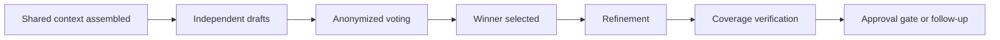

# LLM Council

> [!IMPORTANT]
> **TL;DR** — LoopTroop uses a structured multi-model council (draft → vote → refine → verify) for every planning decision. Models compete independently before converging, so blind spots from any single provider are caught before execution begins.

> [!TIP]
> **Why use a Council?** Think of it like a design agency. If you hire one designer, you get one idea. If you hire three designers, have them pitch ideas independently, and then vote on the best elements from each, the final product is vastly superior. That's exactly what the LLM Council does for your code.

LoopTroop uses a council whenever it is choosing a plan, not just executing one. The council is a structured draft, vote, refine pipeline that is reused across interview generation, PRD creation, and bead planning.

## 1. Where The Council Appears

| Domain | Draft phase | Vote phase | Refine phase | Coverage follow-up |
| --- | --- | --- | --- | --- |
| Interview | `COUNCIL_DELIBERATING` | `COUNCIL_VOTING_INTERVIEW` | `COMPILING_INTERVIEW` | `VERIFYING_INTERVIEW_COVERAGE` |
| PRD | `DRAFTING_PRD` | `COUNCIL_VOTING_PRD` | `REFINING_PRD` | `VERIFYING_PRD_COVERAGE` |
| Beads | `DRAFTING_BEADS` | `COUNCIL_VOTING_BEADS` | `REFINING_BEADS` | `VERIFYING_BEADS_COVERAGE` then `EXPANDING_BEADS` |

## 2. Council Lifecycle

The important detail is independence. Models do not co-author one shared draft during the draft stage.

## 3. Step 1: Independent Drafting

Each council member receives the same allowed context for the stage and produces its own artifact:

- interview question set
- PRD draft
- bead blueprint

This is where LoopTroop deliberately seeks diversity. A single draft tends to encode one model's blind spots. Multiple independent drafts surface alternative framing, edge cases, and decomposition strategies.

PRD drafting has an extra first part: each member first produces its own Full Answers artifact from the approved interview, filling skipped answers when needed. The member then drafts its PRD from that completed answer set. After voting and refinement, the winning model's Full Answers artifact is available read-only from the PRD approval screen as supporting context.

Full Answers, PRD and beads drafting, refinement, coverage, and bead expansion can use focused read-only repository inspection when their supplied artifacts do not provide concrete evidence for a repository-specific claim. They review `relevant_files` first and inspect only the smallest useful manifests, build definitions, task configuration, CI files, or source locations needed to confirm a command, path, framework, package manager, build system, or test runner. Full Answers use inspection only for technical facts needed to resolve skipped answers; all voting remains tool-disabled.

If a member's Full Answers artifact is invalid after the configured structured retries, that member's PRD draft is not started. LoopTroop records a concise skipped/invalid PRD draft diagnostic instead of copying the Full Answers malformed text into the PRD draft artifact.

Rejected model responses are diagnostic data, not draft bodies. Accepted drafts persist normalized artifact content; invalid, failed, or timed-out outputs show only outcome, model, validation/retry diagnostics, and short excerpts in the structured artifact view. The full malformed responses remain available through Raw attempt views and execution logs.

## 4. Step 2: Structured Voting

Voting is not "pick the one you like." It is a structured evaluation pass over anonymized drafts.

LoopTroop reduces obvious bias by:

- removing authorship from the drafts
- randomizing presentation order
- recording per-model vote artifacts
- resolving the winner from structured scores and ranking output

The goal is not consensus chat. The goal is competitive evaluation under the same rubric.

## 5. Step 3: Refinement

Once a winner is selected, the winning direction is refined into the canonical artifact for the phase. This process is driven by the orchestration logic in `server/council/refiner.ts` and supported by utilities in `server/council/draftUtils.ts` to merge the strongest elements from competing drafts into the final output.

That refined artifact is what later phases see:

- the interview document feeds the Q&A loop
- the PRD feeds beads planning
- the beads plan feeds execution

## 6. Step 4: Coverage

The council does not end at "winner picked." LoopTroop then checks whether the artifact is complete enough to move on.

| Domain | Coverage action |
| --- | --- |
| Interview | Generate targeted follow-up questions when gaps remain |
| PRD | Revise the PRD until coverage is acceptable or the pass budget is exhausted |
| Beads | Revise the bead plan until coverage is clean or capped (`VERIFYING_BEADS_COVERAGE`), then expand into execution-ready beads in a separate `EXPANDING_BEADS` pass |

This is why the council is better understood as a planning discipline than as a single phase.

## 7. Inputs And Outputs By Stage

| Domain | Main council inputs | Main output |
| --- | --- | --- |
| Interview | Ticket details, relevant files | Canonical interview document and question session |
| PRD | Ticket details, relevant files, approved interview, member-specific Full Answers | Approved PRD |
| Beads | Ticket details, relevant files, approved PRD | Expanded bead plan |

Each domain inherits only the artifacts it needs. See [Context Engineering](context-engineering.md) for the exact allowlists.

## 8. Quorum And Failure

The council is configured, not open-ended.

Important controls include:

- the chosen main implementer
- council member list
- per-project or profile quorum settings
- AI response timeout

> [!TIP]
> For the full reference including defaults, ranges, and practical guidance for all of these settings, see the [Configuration Reference](/configuration).

### Main Implementer

The main implementer is the primary model LoopTroop locks onto the ticket once work starts. It handles the early single-model groundwork, stays auto-included in the council, and remains the primary execution model during coding and final verification.

### Council Members

Council members are the additional models that participate in independent drafting and structured voting during interview, PRD, and beads planning. They increase planning diversity, but they do not replace the main implementer as the ticket's primary execution owner.

### Min Council Quorum

Minimum council quorum is the smallest number of valid council outputs LoopTroop requires before it trusts a draft or vote phase. If the configured quorum is not met, the workflow blocks or retries instead of silently accepting a weak result.

### AI Response Timeout

AI response timeout is the per-model wait budget for planning and review prompts that expect model output, including relevant-files scanning, council drafting and voting, coverage/refinement, setup-plan drafting, final-test model prompts, and PR drafting. Longer values tolerate slower providers, while shorter values fail faster when a provider is stalled or unavailable.

If too few valid drafts or votes arrive to satisfy quorum, the pipeline does not pretend the result is trustworthy. It fails into `BLOCKED_ERROR` or a phase-specific retry path instead of silently advancing.

## 9. Why LoopTroop Uses Council Instead Of Debate Chat

LoopTroop's council is inspired by multi-model deliberation, but the implementation is intentionally more operational than theoretical.

It chooses:

- parallel independent drafting instead of one shared brainstorm
- structured voting instead of free-form persuasion
- one winning artifact instead of a merged conversation transcript
- durable artifacts instead of latent conversational memory

That makes the result easier to inspect, compare, cache, edit, and restart.

## 10. Human Gates Still Matter

The council does not replace the human. It prepares artifacts for review.

LoopTroop inserts explicit approvals after:

- interview
- PRD
- beads
- execution setup plan

The council improves draft quality, but the human still authorizes the next irreversible stage.

## 11. What Lives In Storage

Council work is persisted in both artifact and runtime form:

- draft artifacts
- vote artifacts
- winner and refinement artifacts
- coverage artifacts
- per-model logs and session records

That storage is what allows phase review, restart, and auditability in the UI.

## 12. Refinement Change Tracking

LoopTroop records structured metadata about every council refinement so the UI can show exactly what changed, why, and which source draft inspired each modification. The system is implemented across `shared/refinementChanges.ts` and `shared/refinementDiffArtifacts.ts`.

### 12.1 Change Types

Each refinement change is classified by `RefinementChangeType`:

| Type | Meaning |
| --- | --- |
| `modified` | An existing item was changed (e.g., a PRD user story was reworded) |
| `added` | A new item was introduced during refinement |
| `removed` | An item present in the winning draft was dropped |

### 12.2 Attribution Tracking

Changes carry an `attributionStatus` that records how the change originated:

| Status | Meaning |
| --- | --- |
| `inspired` | The change was adopted from a specific losing draft |
| `model_unattributed` | The change appeared but could not be attributed to a particular source |
| `synthesized_unattributed` | The model synthesized new content not present in any draft |
| `invalid_unattributed` | The change record was malformed and could not be attributed |

When a change is inspired by a specific draft, `refinementChangeInspiredItem` records which draft index and council member provided the inspiration, along with the original item text.

### 12.3 UI Diff Artifacts

`shared/refinementDiffArtifacts.ts` defines the structure used to render refinement diffs in the UI. Each artifact is scoped to a council domain:

| Domain | Covers |
| --- | --- |
| `interview` | Interview question refinements |
| `prd` | PRD epic and user story refinements |
| `beads` | Bead blueprint refinements |

A `UiRefinementDiffArtifact` contains:

- The winning model ID and generation timestamp
- An ordered array of `UiRefinementDiffEntry` items, each with:
  - **`key`** — Stable identifier for the changed item
  - **`changeType`** — `modified`, `replaced`, `added`, or `removed`
  - **`itemKind`** — What kind of item (`epic`, `user_story`, `bead`, `question`, etc.)
  - **Before and after** IDs, labels, and text for `modified` and `replaced` entries
  - **Inspiration** metadata linking back to the source draft and council member

### 12.4 PRD-Specific Parsing

For PRD refinements, `shared/refinementDiffArtifacts.ts` also defines `ParsedPrdDocument`, `ParsedPrdEpic`, and `ParsedPrdUserStory` types used to compare before/after PRD versions and extract meaningful structural diffs.

PRD and Beads refinement validators also protect stable item identifiers. They reject `modified` records whose before/after IDs differ unless the validated winner, final artifact, and explicit addition prove one unique displacement: a new item reused a survivor's ID and moved that survivor to an unused ID. In that bounded case, LoopTroop restores both IDs without changing text and exposes the exact correction in the artifact intervention details. PRD duplicate change entries that resolve to the same canonical modification are collapsed; conflicting attribution is discarded rather than inferred. Interview refinement is unchanged because its `replaced` change type intentionally permits different IDs.

## Related Docs

- [Context Engineering](context-engineering.md)
- [Ticket Flow & State Machine](ticket-flow.md)
- [Beads & Execution](beads.md)
- [System Architecture](system-architecture.md)
