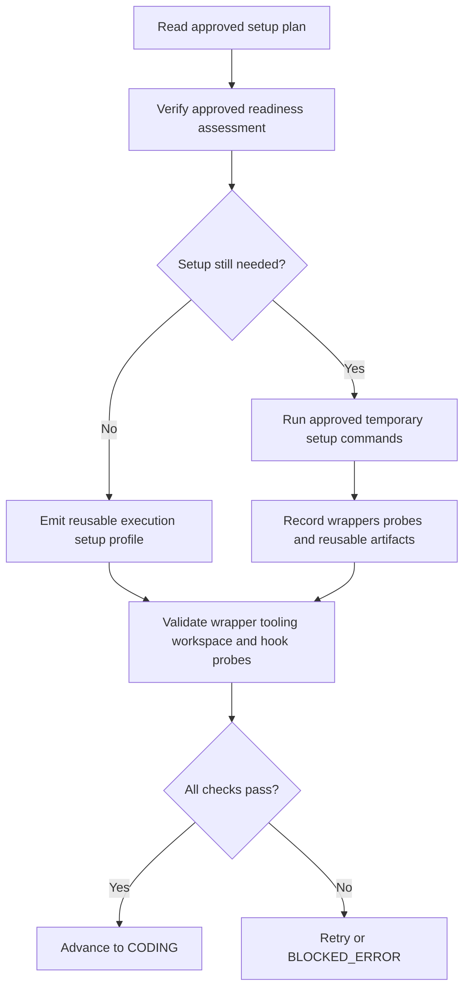

# Pre-Implementation

Pre-implementation is the execution-band handoff between approved planning and real code changes. It verifies that the ticket can safely leave planning, turns the setup contract into a reviewable artifact, and prepares temporary runtime state that later coding and final-test phases can reuse.

LoopTroop splits this into four workflow statuses so active model work and human approval are never represented by the same state:

| Status | Purpose | Main outputs |
| --- | --- | --- |
| `PRE_FLIGHT_CHECK` | Deterministic readiness gate before any setup or coding work starts. | `preflight_report` artifact + per-check SYS log entries |
| `GENERATING_EXECUTION_SETUP_PLAN` | Drafts or regenerates the reviewable setup contract without modifying project files. | Generated `execution_setup_plan`, generation report, raw attempts and diagnostics |
| `WAITING_EXECUTION_SETUP_APPROVAL` | Pauses for human review of a separately published approval copy. | Approval-copy `execution_setup_plan`, notes, approval receipt, edit receipts |
| `PREPARING_EXECUTION_ENV` | Executes only the approved temporary setup and emits the reusable runtime profile. | `execution_setup_profile`, `execution_setup_report`, runtime files under `.ticket/runtime/execution-setup/**` |

---

## 1. `PRE_FLIGHT_CHECK`: deterministic readiness gate

When the beads plan is approved, LoopTroop runs the **Pre-Flight Doctor** (`server/phases/preflight/doctor.ts`). This phase does not prepare tooling yet; it only proves that the ticket is safe to enter execution setup.

### 1.1 What it validates

The doctor checks six areas:

| Area | What LoopTroop verifies |
| --- | --- |
| **OpenCode and model reachability** | OpenCode health, locked main-implementer availability, and a real execution-mode probe session using `PROM_EXECUTION_CAPABILITY_PROBE`, which must return exactly `OK`. |
| **Ticket and planning artifacts** | The ticket workspace exists, `relevant-files.yaml` is checked and warned on when missing, at least one bead exists, and the beads approval receipt is available. |
| **Dependency graph integrity** | No dangling references, self-dependencies, duplicate bead ids, or cycles, and at least one bead is runnable immediately. |
| **Git safety** | The ticket worktree exists, is on a real branch, and has no pre-existing committable project changes. Generated or local untracked noise is downgraded to warnings with suggested `.gitignore` entries. |
| **GitHub delivery prerequisites** | `origin` resolves to GitHub, `gh` is installed, authentication works, and the authenticated account can access the target repo. |
| **Concurrency and budget guards** | No other real workflow ticket in the same project is already inside the execution band; display-only mock/demo tickets are ignored because they cannot run workflow work. `maxIterations` must also be valid (`0` means unlimited). |

### 1.2 Why the execution probe matters

The execution-capability probe is stricter than a plain health check. LoopTroop creates a temporary execution-mode OpenCode session with the same locked model and variant planned for real work, dispatches a tiny read-only prompt, requires the exact response `OK`, and then tears the session down. That catches session-creation, tool-policy, or model-behavior failures before runtime setup or coding starts.

### 1.3 Outcomes and failure behavior

- LoopTroop persists a `preflight_report` artifact containing every pass, warning, and failure.
- Each check is also emitted into the **SYS** log so the UI shows the same detail without opening raw artifacts.
- Any `fail` result routes the ticket to `BLOCKED_ERROR`.
- `warning` results are preserved but do **not** block execution.

> [!WARNING]
> This phase is intentionally non-mutating. If the worktree already contains committable project changes, LoopTroop blocks here instead of letting setup or coding absorb unrelated edits into later bead commits.

---

## 2. `GENERATING_EXECUTION_SETUP_PLAN`: draft the setup contract

After pre-flight passes, LoopTroop enters **Drafting Workspace Setup Plan**. It records the current host (Windows, macOS, Linux, or WSL-as-Linux), available shells, and architecture, then asks the locked main implementer to audit the approved ticket context and propose an `execution_setup_plan`. The proposal is combined with backend-owned identity, host, hook, and policy evidence. A model cannot make the ticket fail by echoing those backend fields in the wrong shape.

This is an active `in_progress` phase, but it remains read-only with respect to project files. No setup commands run until a later approval. Its workspace is intentionally nonblank: the live generation log is expanded, an artifact placeholder explains what is being produced, and the full structured plan plus generation report appears when ready. Archived drafting attempts are available from the version selector.

### 2.1 Generation and artifact ownership

`server/workflow/phases/executionSetupPlanPhase.ts` assembles the execution-setup planning context from durable artifacts, including ticket details, relevant files, approved beads, and any prior reusable execution-setup profile. On first entry, the draft is generated automatically if no current setup-plan artifact exists.

A valid result remains attached to the drafting attempt, then LoopTroop creates a fresh `WAITING_EXECUTION_SETUP_APPROVAL` attempt and publishes a self-contained approval copy of the plan and report. This separation keeps the original generated candidate and diagnostics in drafting history while ensuring runtime setup later reads the user-reviewed approval copy.

If structured-output retries are exhausted, LoopTroop preserves the rejected output, generation report, raw attempts, and diagnostics in the drafting attempt, then still advances to approval. The approval view disables Approve and Edit but keeps Regenerate available. Malformed draft text is never treated as an approved plan, and this reviewable outcome does not route the ticket to `BLOCKED_ERROR`. Unexpected operational failures still use `BLOCKED_ERROR`; Retry returns to the drafting status.

The setup-plan artifact is structured around a small, explicit contract:

| Section | Meaning |
| --- | --- |
| `readiness` | Whether the environment is already `ready`, only `partial`, or still `missing` key requirements, plus supporting evidence and gaps. |
| `temp_roots` | Repository-local or runtime-owned paths the next phase may use for temporary setup work. |
| `host_context` | Backend-detected current host, execution environment, architecture, available shells, and preferred shell. The plan is reusable on this host, not promised to run unchanged on every host. |
| `workspace_inputs` | Ignored or untracked non-reproducible files and directories needed for setup. Each entry records a repository-relative path, kind, category, Git status, reason, and copy preview. Generated dependencies, caches, and build output must be recreated instead of copied. |
| `workspace_probes` | Ordered repository-level structured commands that prove the prepared checkout can actually perform project work; each entry has an `id`, `command`, and `purpose`. |
| `git_hooks` | The resolved policy, read-only detected-hook evidence, and an ordered editable list of explicit validation commands. |
| `steps` | Ordered setup actions with structured commands plus `id`, `title`, `purpose`, `required`, `rationale`, and step-level `cautions`. |
| `project_commands` | Discovered project-wide command families such as prepare, full test, lint, and typecheck. |
| `quality_gate_policy` | The default policy later coding and final-test phases should follow for tests, lint, typecheck, and full-project fallback behavior. |
| `cautions` | User-facing warnings or assumptions that should remain visible after approval. |

The planning prompt receives the original checkout and ticket worktree as read-only locations. It checks whether a missing ignored or untracked file or directory explains a concrete readiness problem. It does not list unrelated caches, dependencies, build output, or the complete ignored-file inventory. The user can edit every proposed input before approval.

If the workspace is already ready, LoopTroop treats that as a first-class result: `steps` can be empty, and the artifact stays reviewable instead of inventing filler setup commands. A non-empty `workspace_inputs` list still counts as required setup work because LoopTroop must materialize those inputs before validation.

## 3. `WAITING_EXECUTION_SETUP_APPROVAL`: review the setup contract

The approval status contains no automatic model work. The user reviews the published plan, including its backend-owned current-host, identity, policy, and hook evidence, before authorizing runtime setup.

### 3.1 Edit, regenerate, and version semantics

1. **Manual edit** updates the structured approval copy or raw content directly. LoopTroop saves the canonical normalized artifact and records append-only `user_edit_receipt:execution_setup_plan` history with before/after hashes.
2. **Regenerate** durably records the commentary and the current structured or unsaved raw baseline, archives the current drafting and approval attempts, creates fresh attempts, and transitions immediately to `GENERATING_EXECUTION_SETUP_PLAN`. The runner consumes that request after a restart or blocked-error retry as well as during uninterrupted operation.
3. **Each regeneration is a version.** The completed generation publishes a new approval copy; older drafting and approval attempts remain read-only through phase-attempt history.

The drafting attempt's generation report preserves raw model output, validation errors, structured-output retry diagnostics, rejected or accepted raw attempts, and regeneration commentary. Approval history separately preserves the exact copies the user reviewed or edited.

### 3.2 Approval handoff and rewind behavior

Approving the plan first refreshes the host and Git-hook evidence. If either changed, LoopTroop updates the draft hash and asks for review again. Approval then stores a receipt with the reviewed `content_sha256`, host, step count, command count, approved workspace inputs, selected ticket-run Git-hook policy, detected evidence, workspace probes, and exact validation-command list. Detected evidence is read-only, while the inherited hook policy is only the initial choice and may be overridden for this run without changing its project or profile source.

While the ticket is still in `PREPARING_EXECUTION_ENV`, editing or regenerating the setup plan triggers a **runtime rewind** rather than an in-place overwrite:

- the active setup session is stopped
- the relevant setup-plan and runtime attempts are archived
- stale runtime outputs are cleared
- `.ticket/runtime/execution-setup/tool-cache` is preserved
- manual editing returns directly to `WAITING_EXECUTION_SETUP_APPROVAL` with the current plan
- regeneration enters `GENERATING_EXECUTION_SETUP_PLAN` with a durable baseline/commentary request
- approval is required again before setup restarts

That keeps the approved contract explicit and prevents a running setup session from drifting away from what the user last reviewed.

Current-host or Git-hook evidence changes detected while approving do not require another model generation. LoopTroop refreshes the existing approval copy and stays in `WAITING_EXECUTION_SETUP_APPROVAL` so the user can review the changed evidence.

---

## 4. `PREPARING_EXECUTION_ENV`: temporary runtime setup

Once the plan is approved, LoopTroop moves to `server/workflow/phases/executionSetupPhase.ts`. This phase is AI-driven and retryable, but it is still **not** a bead: it never creates commits, never pushes, and never counts as implementation progress.

### 4.1 Approved-plan-first execution

The setup agent reads the **approved** plan first. User edits override the model's original draft. If the approved plan says the environment is already ready and that still holds, the phase should stay nearly no-op: verify the claim, emit the reusable profile, and move on without inventing bootstrap work.

When setup is still needed, the agent may:

- use the approved ignored or untracked workspace inputs that LoopTroop materialized before the setup session
- run only the approved temporary setup steps
- inspect the repository and invoke repo-native bootstrap commands
- prepare runtime-owned wrappers or caches
- create reusable artifacts under `.ticket/runtime/execution-setup/**`

If required launchers or toolchains are missing, the agent must try real user-space provisioning strategies under approved temp roots before reporting failure. Simple PATH edits, wrapper creation, cache inspection, or version probes do **not** count as provisioning strategies.

### 4.2 Validation rules before a profile is accepted

LoopTroop does not trust a superficially valid setup response. A setup result is accepted only when all of the following are true:

- the structured result parses and all setup checks pass
- the structured runtime environment contains only repository-relative PATH additions and explicit variables
- declared `tooling_probe_commands` exist and succeed
- approved `workspace_probes` run in order with their direct-process or named-shell semantics; when repository command families or bead test commands exist, at least one probe must exercise the repository rather than only print a tool version
- approved Git-hook validation commands use the same structured executor, timeout, output capture, and tracked-file audit rules under Check or Require
- profiles that declare project command families include non-mutating probes
- failed tooling results include durable `tool_requirements` evidence:
  - either at least two distinct `provisioning_attempts` strategies with real commands
  - or a `not_provisionable` result with a concrete `failure_reason`

Before setup commands run, LoopTroop validates every approved workspace input against the original checkout and Git status. It rejects missing sources, reproducible dependency/cache/build categories, incorrect ignored or untracked classifications, paths outside the checkout, symlinks, and Git or LoopTroop internal paths. The approval view shows eligible file count and total bytes. Copies above the conservative default limit require an explicit per-input override. Tracked ticket source always wins and is never replaced.

LoopTroop also audits the worktree after each ready-looking attempt. Committable project changes left behind by setup fail the attempt. Generated noise is kept as a warning and copied into the profile cautions with suggested `.gitignore` entries. The setup agent may not copy any additional ignored or untracked path that the user did not approve.

Hook discovery is evidence, not an ecosystem assumption. LoopTroop inspects Git's resolved hook path, actual hook files, and recognizable manager configuration as different evidence kinds. Runnable state is **yes**, **no**, or **unknown**; native Windows evidence can remain unknown. Known managers may supply a hint, but unknown managers remain visible without an invented command. Ticket → project → profile inheritance provides the initial selection, and setup approval may override it for this ticket run:

- **Observe** (`observe_only`) bypasses hooks for internal commits and pushes and records that explicit validation was skipped
- **Check** (`validate_advisory`, recommended) bypasses native hooks and runs approved commands as visible advisory checks; failure or timeout warns but does not block
- **Require** (`validate_required`) bypasses native hooks and treats an approved validation failure as a blocking gate
- **Run** (`use_native_hooks`) leaves normal Git hook execution enabled

Check, Require, and Run are deliberately different. Check and Require execute reviewed commands outside Git and audit any files they change, restoring only changes those checks introduced. Run allows a repository hook to execute inside and potentially block or modify the Git operation itself.

### 4.3 Setup-scoped web tools, retries, and reset behavior

This is the one execution-band phase where LoopTroop can enable setup-scoped `websearch` and `webfetch` so the agent can look up official release or launcher metadata when repository files do not identify a required tool artifact locally.

If an attempt fails:

1. LoopTroop appends an execution-setup retry note.
2. It resets tracked files back to the setup phase start commit.
3. It preserves LoopTroop-owned runtime artifacts under `.ticket`, especially `tool-cache`.
4. It clears stale profile and wrapper outputs.
5. It retries until the normal setup budget is exhausted or a repeated tooling blocker becomes terminal.

The final report keeps the retry notes and per-attempt history so the user can see how setup evolved and why it eventually succeeded or blocked.

When the automatic retry budget ends in `BLOCKED_ERROR`, the live error view offers two setup-specific recovery actions. **Retry with extra note...** opens a dialog and sends only the entered text to the preserved `PREPARING_EXECUTION_ENV` OpenCode session. It keeps the current runtime phase attempt, does not add the note to future setup context, and allows exactly one manual setup attempt beyond the configured automatic budget. **Edit setup plan...** opens a confirmation dialog. After confirmation, it archives the failed runtime attempt, returns the ticket directly to `WAITING_EXECUTION_SETUP_APPROVAL`, and opens the current plan for editing. Choosing Regenerate from there sends the cleaned setup failure and current plan through a new `GENERATING_EXECUTION_SETUP_PLAN` version so the model can propose a missing workspace input when the evidence supports one. Historical error occurrences remain read-only.

### 4.4 What gets persisted

Successful or failed setup attempts produce durable artifacts:

| Artifact or path | Purpose |
| --- | --- |
| `execution_setup_profile` | Canonical reusable profile containing temp roots, bootstrap commands, tooling and workspace probes, resolved Git-hook policy/evidence/validation commands, optional tool-requirement evidence, reusable artifacts, discovered project commands, and quality-gate policy. |
| `execution_setup_report` | Final status, attempt history, retry notes, probe and hook outcomes, structured-output diagnostics, worktree warnings, raw attempts, and the diff between approved-plan commands and any audited execution-time additions. |
| `.ticket/runtime/execution-setup-profile.json` | Mirror of the accepted profile for later phases that prefer reading a file path instead of loading the artifact body inline. |
| `.ticket/runtime/execution-setup/**` | Runtime-owned temp state such as the current host's launcher, caches, and tool downloads. |

### 4.5 Impact on later phases

Pre-implementation directly shapes later execution:

- **Coding** receives the reusable setup profile path instead of rediscovering environment state from scratch.
- **Final testing** executes structured current-host commands with the setup profile's PATH additions and variables applied directly.
- **Bead commits** ignore setup-owned runtime roots so prepared toolchains and caches do not become implementation diffs, and apply the approved hook policy consistently.
- **Integration** reruns approved explicit hook validations before incorporating the candidate and exposes executed or skipped outcomes in final review.
- **Cleanup** removes the temporary runtime roots at ticket end while leaving the audit artifacts and execution log intact.

---

## Related Docs

- [Ticket Flow & State Machine](ticket-flow.md)
- [Beads & Execution](beads.md)
- [Post-Implementation](post-implementation.md)
