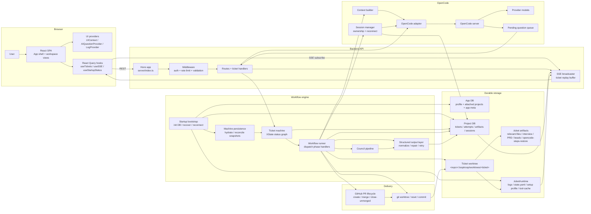

# System Architecture

> [!IMPORTANT]
> **TL;DR** — LoopTroop is a local control plane: a React browser client talks to a Hono backend, durable state lives in SQLite plus `.ticket/**` artifacts, each ticket executes in its own git worktree, and all model work goes through OpenCode behind a session-ownership layer. On restart, the backend rebuilds runtime projections, hydrates ticket actors, and reconnects only the sessions it still owns.

This document is the canonical architecture reference for the current LoopTroop application.

LoopTroop is not a thin chat wrapper around a coding model. It is a long-running workflow system with explicit planning phases, durable storage, isolated execution worktrees, resumable ticket actors, and restart-aware OpenCode session ownership. The core architectural rule is simple: **important state must survive the model and survive the browser**.

> [!NOTE]
> **Next release behavior.** The durable approval-save and runtime-recovery
> details on this page are upcoming: content-hash save preconditions, retained
> drafts, best-effort leaving flushes, and conditional step-cap or hook recovery.
> A recovery conflict can refuse destructive reset; browser unload is not a
> delivery guarantee. The same upcoming scope includes durable same-PR review
> decisions, server-advertised blocked actions, click-time Manual QA snapshots,
> action-triggered complete log history with typed cursor expiry, and actual-
> value form snapshots that preserve edits through hydration and save races.
> The request guards, child-process credential filtering, and static
> process-launch and filesystem checks described below are also upcoming.

## 1. Mental Model

LoopTroop operates as a layered local system:

1. The browser runs a React SPA plus local providers for UI state, log caching, and AI question handling.
2. A Hono API owns the REST and SSE boundary and applies auth, rate limiting, and JSON validation before requests reach workflow code.
3. XState ticket actors hold the live workflow state machine, while the workflow runner dispatches the phase-specific handlers.
4. Council orchestration and structured-output normalization turn raw model text into bounded, typed artifacts before anything becomes canonical.
5. Durable truth lives in SQLite, `.ticket/**` artifacts, runtime projections, and JSONL logs rather than in model transcripts.
6. OpenCode sessions do the model work inside isolated ticket worktrees, and Git/GitHub delivery turns the resulting change set into a PR outcome.

Form drafts are deliberately browser state until a write succeeds. Configuration,
project, ticket, and prompt callers compare actual current values with a saved or
initial snapshot, including custom controls. Hydration and refetch preserve a
dirty draft, a completed save acknowledges only the submitted snapshot, and a
failed save leaves it dirty; an unsaved modal draft is not treated as reload-
durable state.

### Control-plane boundaries

The Hono boundary keeps the installed daemon loopback-only unless the operator
explicitly enables a wider bind. Remote requests with session cookies still
need a canonical same-origin proof, while bearer-only script calls remain
available. The API token that authorizes a wider bind is separate from the
daemon-minted live API and browser-session credentials. In local mode, the
request Host authority must be recognized as loopback. Origin parsing rejects
non-canonical hostname spellings, including alternate IPv4 forms, and a
same-authority Origin must match the actual request scheme, hostname, and
effective port; explicit port `0` is rejected. Explicit configured development
origins retain their configured scheme and authority. Remote opt-in does not add
a new strict Host-name validator to requests without an Origin. Forwarded host
values do not widen the trusted authority.

Project commands, Git and hooks, doctor tool probes, and managed or development OpenCode launches
receive copied environments after their overrides are merged. The child
boundary removes only LoopTroop's two daemon credential names and retains
intentional provider and Git credentials. The trusted CLI-to-daemon handoff is
kept intact. This is credential propagation control, not a process sandbox.

Filesystem safety is enforced at runtime by contained, no-follow, managed-root,
and ticket-root helpers. Static checks reinforce those contracts with known
syntax forms and exact filename-plus-operation boundaries, including a
metadata-only project-folder browser. They do not claim whole-program alias or
dataflow analysis, so new raw operations must use the existing helpers and stay
narrow.

The static checks cover literal and static-template loaders, built-in module
loading, re-exports, namespace destructuring, and nested filesystem promises.
Raw directory iteration is covered too. These checks do not trace arbitrary
values through dynamic imports or aliases.

SSE reserves the client before collecting replay events and activates live
delivery afterward. If activation loses a race with disconnect, cleanup runs
immediately and observes outstanding handshake writes without waiting for them
to settle.

## 2. Runtime Actors

| Actor | Responsibility | Primary modules |
| --- | --- | --- |
| Browser shell | App bootstrap, modal/URL coordination, dashboard vs ticket workspace switching, startup notices | `src/main.tsx`, `src/App.tsx`, `src/components/layout/*` |
| Browser state providers | Persistent UI state, AI question queue, and bounded per-ticket live-log overlay | `src/context/UIContext.tsx`, `src/context/AIQuestionContext.tsx`, `src/context/LogContext.tsx` |
| React Query + SSE hooks | Fetching, cache invalidation, replay recovery, startup-status fetches | `src/hooks/*`, especially `useTickets.ts`, `useTicketArtifacts.ts`, `useSSE.ts`, `useStartupStatus.ts` |
| Hono API | REST routes and SSE endpoint under `/api` | `server/index.ts`, `server/routes/*` |
| API guard rails | CORS, token auth, per-bucket rate limiting, JSON validation | `server/middleware/*` |
| Ticket state machine | Canonical ticket statuses, legal transitions, blocked-error resume rules | `server/machines/ticketMachine.ts`, `server/machines/types.ts` |
| Actor persistence and hydration | Snapshot reconciliation, safe restore, startup hydration of non-terminal tickets | `server/machines/persistence.ts`, `server/startup.ts` |
| Phase orchestrators | Planning, approval, execution, retry, cleanup, and delivery logic | `server/workflow/*`, `server/phases/*` |
| Council + structured output layer | Draft/vote/refine orchestration, tagged-output parsing, schema normalization, retry diagnostics | `server/council/*`, `server/structuredOutput/*`, `server/phases/parserTaggedStructuredOutput.ts`, `server/lib/structuredOutput*.ts` |
| OpenCode integration | Session creation, prompting, event/question translation, ownership validation, blocked-error diagnostics | `server/opencode/*` |
| SSE broadcaster + execution logging | Ticket-scoped fan-out, replay buffer, durable log ingestion, session-status log translation | `server/sse/broadcaster.ts`, `server/log/*`, `server/workflow/sessionStatusLogging.ts` |
| App database | Singleton profile, attached projects, startup UI meta | `server/db/index.ts`, `server/db/init.ts` |
| Project database + ticket storage | Tickets, artifacts, phase attempts, OpenCode sessions, error history, runtime projections | `server/db/project.ts`, `server/storage/*` |
| Git and GitHub layer | Worktrees, diffs, commits, PR creation, merge/close flows | `server/phases/execution/gitOps.ts`, `server/git/*` |
| Startup bootstrap | Database init, crash recovery, WSL/runtime diagnostics, actor hydration, session reconnect | `server/startup.ts`, `server/startupState.ts`, `server/runtime.ts` |

## 3. Authoritative Data Ownership

LoopTroop deliberately splits state across several storage layers. Each layer owns a different class of truth.

| Storage location | Primary contents | Notes |
| --- | --- | --- |
| `~/.config/looptroop/app.sqlite` by default | Singleton profile, attached projects, app meta such as startup restore-notice dismissal | Configurable via `LOOPTROOP_CONFIG_DIR` or `LOOPTROOP_APP_DB_PATH` |
| `<project>/.looptroop/db.sqlite` | Tickets, runtime metadata, OpenCode session ownership, `phase_artifacts`, `ticket_phase_attempts`, status history, error occurrences | This is the project-local operational database |
| `<project>/.looptroop/worktrees/<ticket>/` | The isolated ticket worktree used for planning artifacts, runtime files, and code changes | Startup blocks if `.looptroop` is tracked by Git so stale runtime data cannot be checked out into new worktrees; `.ticket/**` stays local LoopTroop state and is excluded from bead commits and PR diffs |
| `.ticket/relevant-files.yaml` | Relevant-file scan output used by later planning phases | Replaces older `codebase-map.yaml` terminology |
| `.ticket/interview.yaml` and `.ticket/prd.yaml` | Editable review artifacts for the approved planning stages | These are the user-facing planning documents |
| `.ticket/beads/<baseBranch>/.beads/issues.jsonl` | The current bead plan for one ticket/base-branch flow | Stored as JSONL, rewritten atomically on updates |
| `.ticket/runtime/execution-log.jsonl`, `.debug.jsonl`, `.ai.jsonl` | Durable workflow, debug, and AI-detail log channels | Live rows arrive through SSE; reload/history reads use the cooperative SQLite projection and paginated `/api/tickets/:id/logs` route |
| `.ticket/runtime/state.yaml` | Derived runtime projection for the active non-terminal ticket | Rebuilt from ticket state on startup; convenient to inspect, but not the only source of truth |
| `.ticket/runtime/execution-setup-profile.json` | Concrete execution environment profile produced after approved setup runs | Separate from the reviewable execution setup plan artifact |
| `.ticket/opencode-steps-restore.json` | Recovery sidecar for temporarily capped `opencode.json` | Lets startup restore the exact pre-run bytes only when the run-owned `opencode.json` is still unchanged; a conflicting file stays visible with its marker, and a missing marker supplies no ownership evidence |
| `.ticket/runtime/hook-validation-restore.json` | Identity-bound restore marker for protected Git-hook validation | Records the worktree and Git-directory identities, index/worktree trees, and initial untracked set; invalid or escaped markers fail before recovery writes, while unknown additions stay intact |
| Known config and ticket temp sidecars (`.proof`, `.recovery`, `.recovery.write-*`, and retained `.remove-*`) | Write-completeness, fallback ownership, and private cleanup records | Unproved orphan YAML/whole-file JSONL temps stay in place with a warning; an unresolved in-progress fallback marker can block startup, and cleanup has a separate scope |
| `.ticket/runtime/execution-setup/**`, especially `tool-cache/` | Ticket-owned temp roots, wrapper outputs, execution-only toolchains, and reusable caches | Preserved across setup-plan rewinds when safe so retries do not throw away valid tool caches |
| `.ticket/manual-qa/**` | Versioned checklists/results/coverage, evidence binaries, generation/operation receipts, clean baselines, and workspace-drift decisions | Outside CLEANING_ENV's selected transient roots and excluded from bead commits, candidate diffs, and PRs; explicit Delete Worktrees removes the containing worktree; evidence index locking uses a persistent SQLite database |
| `phase_artifacts` table | Structured snapshots, receipts, and UI read models used by the API and UI | Holds artifact content, phase, attempt number, timestamps, approval receipts, edit receipts, cleanup/integration reports, and content hashes. Lightweight manifest/content endpoints are available for targeted consumers; the historical phase review keeps its established curated artifact-card presentation. |

The log projection also indexes native OpenCode files in incremental ranges.
Complete DEBUG/history actions can read older native files beyond the bounded
diagnostic defaults, while the initial view remains paginated. Four recent
native snapshots keep cursors stable across append and rotation; an expired
cursor is a typed error rather than a partial page. Cold or unseen sessions
still scan their needed prefix, upstream-deleted files cannot be recovered,
and native page row materialization is `LIMIT`-bounded while lineage visibility
work grows with ancestry depth.

> Note
> SQLite and the filesystem are complementary, not redundant. The database is optimized for querying, ownership, and workflow bookkeeping; `.ticket/**` keeps user-facing docs, durable logs, and ticket-owned recovery/runtime files inspectable without polluting the target repository branch. Some `.ticket/**` files are canonical documents, while others are derived projections or recovery sidecars.

### Durable State Beats Conversational Memory

The reason state is split across these layers is a deliberate design commitment: durable storage beats conversational memory. LoopTroop stores meaningful workflow state in places that can be inspected, queried, and rebuilt — SQLite, `.ticket/**` YAML and JSONL artifacts, durable execution logs, and worktree state tied to git snapshots. If the process restarts, the system recovers from storage, not from a model trying to remember what happened (see [Restart And Session Ownership](#_8-restart-and-session-ownership)).

For the per-table breakdown of which database owns what, see the [Database Schema](database-schema.md).

## 4. End-to-End Ticket Lifecycle

1. A ticket starts in `DRAFT` with editable title, description, and priority.
2. `SCANNING_RELEVANT_FILES` creates `relevant-files.yaml` from the ticket description and repo context.
3. The interview council drafts, votes, refines the interview artifact, and iterates until interview coverage is good enough.
4. The user approves the interview artifact.
5. The PRD council drafts, votes, refines, and coverage-checks the spec.
6. The user approves the PRD artifact.
7. The beads council drafts, votes, refines, expands, and coverage-checks the execution plan.
8. The user approves the beads artifact; LoopTroop drafts the pre-implementation execution setup plan in an active status, then publishes a separate copy for human review.
9. Implementation runs bead by bead in an isolated ticket worktree, with bounded retry per bead.
10. Post-implementation final testing routes either directly to integration or through the start-locked optional `GENERATING_QA_CHECKLIST → WAITING_MANUAL_QA` loop. QA failures become fix beads and return to coding/fresh tests; pass, waiver, or skip continues.
11. Integration, PR creation, review follow-up, and cleanup drive the ticket to `COMPLETED`, `CANCELED`, or `BLOCKED_ERROR`. A verified merge or closed-unmerged decision is durable for the same PR and can resume after an interrupted dispatch; an initial remote refresh failure records a recovery receipt and leaves the ticket waiting without a decision.

The full phase map lives in [Ticket Flow & State Machine](ticket-flow.md).

## 5. Planning Flow

Planning is intentionally artifact-driven.

| Stage | Primary input | Primary output | Why it exists |
| --- | --- | --- | --- |
| Discovery scan | Ticket details | `relevant-files.yaml` | Grounds planning in the actual codebase |
| Interview council | Ticket details, relevant files | Interview document and answer session | Forces ambiguity out before specs |
| PRD council | Ticket details, interview, relevant files, member-specific Full Answers | PRD document | Produces the feature contract |
| Beads council | Ticket details, PRD, relevant files | Execution bead plan | Converts the spec into execution units |
| Execution setup planning | Ticket details, PRD, beads, backend-detected host and Git evidence, original checkout and ticket worktree | Reviewable current-host setup plan with structured commands and approved workspace inputs | Separates the model proposal from backend-owned identity, policy, and evidence before code changes begin |

The planning phases are not one long conversation. Each stage assembles a new context window from durable artifacts and runs in its own session scope.

Councils are a reusable subsystem, not bespoke logic embedded in each phase. The shared council modules in `server/council/drafter.ts`, `quorum.ts`, `voter.ts`, and `refiner.ts` handle the common draft -> quorum -> vote -> refine shape, while each phase provides its own context and normalization rules.

Structured output is a hard boundary. `server/structuredOutput/*` and `server/phases/parserTaggedStructuredOutput.ts` normalize, validate, and optionally repair model output before anything becomes canonical artifact content. Rejected or uncorrectable responses are preserved as diagnostics and raw attempts so downstream phases never consume malformed text as if it were approved state.

Human approval gates are content-addressed. The API exposes the current artifact hash for interview, PRD, beads, and execution setup plan views; approval requests must send `expectedContentSha256`; stale approvals return `409` instead of approving bytes the user did not review. Approval snapshots and receipts keep the reviewed raw content plus `content_sha256`, and interview/PRD receipts also record the post-stamp stored hash when approval metadata changes the YAML.

The workspace viewer keeps display pairing and counts together: equal-length
plan/refined bead lists pair by position, otherwise IDs provide the fallback.
Long single-line text diffs use a bounded fine-grained comparison and return a
full replacement when the safe budget is exceeded. Artifact log readers select
the current phase rows and load action directly, so unrelated streamed context
updates do not repeat expansion parsing.

Interview and PRD raw or structured saves use the same loaded hash as a
precondition. A missing baseline returns `428`; a stale baseline returns the
typed `409` conflict before the authoritative artifact changes. Post-approval
restart edits hold the existing durable ticket claim through the write and
awaited restart, then recheck its exact token before invalidation, so a
competing writer is refused before destructive planning effects. The browser
keeps an unconfirmed dirty draft separate from the server revision, and a
best-effort leaving flush never becomes an unload-delivery guarantee.

## 6. Execution Flow

Execution is built around beads, not around one monolithic coding prompt.

1. `PRE_FLIGHT_CHECK` verifies the ticket can enter pre-implementation setup, including worktree cleanliness before setup starts.
2. `GENERATING_EXECUTION_SETUP_PLAN` performs read-only setup-plan generation in a versioned attempt. A valid candidate and report remain in drafting history and are copied into a fresh approval attempt. Exhausted structured repairs preserve rejected output and diagnostics, then still hand off to approval; unexpected operational failures use `BLOCKED_ERROR`.
3. `WAITING_EXECUTION_SETUP_APPROVAL` pauses for review of the separate approval copy composed from the AI proposal plus backend-owned current-host, identity, locked project policy, and hook evidence. The policy is read-only; raw or structured attempts to change it are normalized back to the ticket-start snapshot. Malformed generation disables Approve/Edit while preserving diagnostics and Regenerate.
4. `PREPARING_EXECUTION_ENV` validates and materializes approved non-reproducible workspace inputs without replacing tracked ticket source, then follows repository evidence and the approved plan without assuming a programming language, build system, or project layout. Direct processes and explicitly named POSIX, Command Prompt, or PowerShell scripts run with repository-relative working directories and structured environment data. One Execution Setup Timeout deadline covers all active work in an attempt; each genuine retry receives a fresh budget.
5. `CODING` selects the next runnable bead from the scheduler and records its start `HEAD` before publishing `in_progress`; a failed checkpoint leaves the bead pending.
6. `executeBead()` starts or reattaches to the owned OpenCode session for that bead attempt.
7. The model must emit the expected structured bead status markers. Missing or malformed markers trigger a structured retry path instead of silently progressing.
8. The coding agent runs the smallest appropriate bead-scoped checks, adapting planned commands when repository evidence requires it, and returns a structured `done/pass` marker. LoopTroop validates that marker and proceeds to local finalization without independently rerunning frozen bead commands; ticket-level Final Testing remains backend executed and mandatory.
9. If the shared coding/verification deadline expires, LoopTroop appends a structured Failed Iteration Note, abandons the session, and attempts a safe reset to the bead start commit before retrying in fresh context. A conflicting OpenCode step-cap marker can refuse that destructive reset while preserving the edited root config and sidecar; a later bead may continue without a fresh cap when no reset is needed, with valid marker evidence excluding the root config from delivery.
10. Only after all declared commands pass does LoopTroop finalize the bead locally. Changed work must be committed, true no-op work may complete without a commit, push failures are warnings, and fatal finalization failures append a separate ANSI-free Finalization Failure Note before routing to manual `BLOCKED_ERROR` recovery.
11. `RUNNING_FINAL_TEST`, optional Manual QA, `INTEGRATING_CHANGES`, and `CREATING_PULL_REQUEST` package the result for delivery. The project's saved Observe, Check, Require, or Run choice is snapshotted at ticket Start and remains authoritative. Setup approval may edit validation commands but not that policy. Integration refreshes drift evidence and applies the locked advisory, required, or native-hook behavior.
12. During all non-terminal execution states, runtime projections and execution logs are updated so a restarted backend or reloaded browser can restore the ticket from durable state rather than from memory.

See [Beads & Execution](beads.md).

## 7. Recovery Flow

Recovery is a first-class architectural concern.

| Failure type | Recovery strategy |
| --- | --- |
| Browser reload, close, or reconnect gap | REST state remains canonical; the browser keeps the last SSE event id, restores best-effort log cache detail, replays buffered live events, and on an SSE `replay_gap` clears the saved cursor and refetches tickets, artifacts, bead state, interview state, Manual QA/AI-detail views, and matching server logs |
| Frontend crash or tab close | Interview drafts, approval drafts, and browser-cached logs are persisted locally and flushed on leaving with best-effort keepalive/beacon behavior; browser unload delivery is not guaranteed, and an optimistic retained draft is not a confirmed server save |
| Confirmed ticket or project deletion | Pending UI-state saves settle before deletion. Success clears the deleted ticket's ticket-scoped query and browser state, including logs, seen notices, UI revisions, rendered markers, the SSE cursor, question-collapse state, and pending ticket-scoped invalidations; ticket lists refetch and unrelated tickets stay intact. A failed deletion releases the save queue, and a reissued id starts without the old cursor in that tab. |
| Concurrent/stale autosave | Approval editors retain the loaded content hash across refetch/remount; missing baselines fail with `428`, stale baselines with typed `409`, and failed saves remain retryable. UI-state writes use per-ticket/scope compare-and-set revisions and latest-wins ordering, retaining failed local drafts while fencing retries against the server revision |
| Crash during atomic write or append | Startup scans canonical roots and known artifact allowlists. It promotes recognized JSON only after parsing, YAML only with a matching byte-length/SHA-256 `.proof`, and whole-file JSONL only when complete; an unproved orphan YAML or torn whole-file JSONL is warned about and left unpromoted, while append logs may receive bounded trailing-line repair. Fallback copies require a complete matching `.recovery` ownership marker and an exclusive no-follow target. An unresolved in-progress fallback marker raises `RecoveryBlockedError` before projections, hydration, or timers; unknown or legacy temps and symlink temps remain visible with diagnostics, and cleanup has a separate scope |
| Invalid model output | Retry with repair or explicit re-prompt, depending on phase |
| Bead execution deadline | Append a Failed Iteration Note, abandon the session, and attempt a safe reset before retrying in fresh context. A conflicting valid OpenCode step-cap marker can refuse the destructive reset and preserve the edited config and sidecar. |
| Interrupted OpenCode step-cap restore | Preserve the edited root config and valid sidecar, refuse a destructive reset that would overwrite it, and let a later bead continue without a fresh cap when no reset is needed. A missing sidecar after restart supplies no ownership evidence. |
| Interrupted protected Git-hook validation | Reuse the identity-bound marker. Invalid or escaped markers fail before recovery writes; unknown untracked additions remain intact and reentry is refused until attribution is resolved. |
| OpenCode reconnect gap | Validate the exact project-local owned session against the remote session and the ticket-contained pending-session marker; preserve all centrally classified blocked-error continuations and all temporarily unverifiable records, and abandon only confirmed-missing or stale ownership. If both SQLite and marker storage are unavailable, only the current process guard remains, so restart recovery is not promised |
| Initial pull-request refresh failure | Record a typed durable recovery receipt with `step: refresh_pull_request`, the PR number, error, and null remote state/URL; keep the ticket in `WAITING_PR_REVIEW` without recording Merge or Close Without Merge success |
| Interrupted pull-request completion | Resume the persisted decision for the same PR after revalidation. A recorded merge or closed-unmerged result fences conflicting Merge, Close Without Merge, and Cancel actions; an observed merged state remains visible even when candidate-head validation refuses completion |
| Backend process restart | Reconcile persisted XState snapshots, hydrate ticket actors from durable ticket state, and immediately process restored active snapshots. Drafting setup plans consume a durable regeneration request exactly once rather than duplicating or losing a generation. An interrupted coding attempt without a preserved continuation or current finalization checkpoint consumes a Failed Iteration Note, resets safely, advances its iteration, and receives a fresh configured deadline |
| User edits approved interview or PRD | Archive the active approved generation and downstream attempts, cancel downstream sessions intentionally, clear stale downstream artifacts/UI state, persist a `user_edit_receipt:*`, and restart from the next drafting phase |
| User edits or regenerates setup plan during runtime setup | Stop active runtime setup, archive the relevant setup-plan/runtime attempts, preserve the tool cache when safe, and clear stale outputs. Editing returns directly to `WAITING_EXECUTION_SETUP_APPROVAL`; regeneration persists the baseline/commentary and enters `GENERATING_EXECUTION_SETUP_PLAN` before fresh approval |
| User retries setup with a note after the automatic budget ends | Keep the failed runtime phase attempt and its OpenCode session, send only the user's note to that session, and allow one manual setup attempt beyond the configured budget |
| User edits the setup plan after a runtime setup block | Ask for confirmation, then archive the failed runtime attempt, return directly to `WAITING_EXECUTION_SETUP_APPROVAL`, and preserve the failed attempt for review. A later Regenerate action enters the drafting status and supplies its cleaned failure |
| Stale approval | Return `409` with the expected and current SHA-256 hashes, keeping the ticket at the approval gate; missing save baselines return `428` before a raw or structured artifact write |
| Manual QA generation/submission restart | Reuse the reserved checklist version or submission operation journal; deterministic action/origin/bead IDs prevent duplicate child work |
| Application-created drift during QA | Stay in `WAITING_MANUAL_QA` and require include/discard for exactly audited paths before submit/skip |
| Bead finalization failure | Append a concise Finalization Failure Note, keep the bead retryable, avoid `bead_complete`, send `BEAD_ERROR` with `BEAD_FINALIZATION_FAILED`, and route to manual `BLOCKED_ERROR` recovery |
| Cleanup warning | Persist a `cleanup_report` with `status: warning`, expose the cleanup summary on the ticket, and still complete the ticket |
| Terminal blockage | Enter `BLOCKED_ERROR` with persisted error occurrence history |

LoopTroop tries hard to preserve the work product while discarding the bad conversational state that produced the failure.

If a ticket resume point cannot be proven, that ticket stays in `BLOCKED_ERROR` instead of continuing against unknown workflow state. `BLOCKED_ERROR` retry requires a preserved `previousStatus`; `CODING` retry also requires a successful reset to the failed bead's `beadStartCommit`. For a live block from `PREPARING_EXECUTION_ENV`, **Retry with extra note...** sends only the entered text to the preserved setup session and grants one manual attempt beyond the automatic budget. It does not archive the runtime phase attempt or add the note to later setup context. **Edit setup plan...** asks for confirmation before it archives the runtime attempt and rewinds to setup-plan approval. Daemon startup recovery is separate: an unresolved in-progress fallback raises `RECOVERY_BLOCKED` before ticket actors hydrate or execution timers start, so it creates no ticket `BLOCKED_ERROR` occurrence or ticket recovery action. Errors shown in summaries and cards are cleaned of ANSI and other terminal control sequences, decoration-only lines, carriage-return artifacts, and consecutive duplicate warnings. Raw logs stay unchanged.

## 8. Restart And Session Ownership

LoopTroop pairs persisted ticket snapshots with OpenCode session ownership records so it can decide whether a remote session still belongs to the exact workflow slot that wants to use it.

Ownership keys can include:

- `ticketId`
- `phase`
- `phaseAttempt`
- `memberId`
- `beadId`
- `iteration`
- `step`

This lets LoopTroop safely reconnect in cases like:

- server restart while a ticket is still in the same phase
- phase retry that should resume the currently owned session
- multi-model council phases where each member has its own session identity
- bead execution where iteration and bead identity both matter

Reconnect deliberately does **not** mean "resume any random old transcript." Validation succeeds only if the ticket is still in the same workflow state, the project database or ticket-contained pending-session marker still records that ownership slot as active, and the exact remote session still exists. When both ownership stores are unavailable, a current-process guard cannot establish restart recovery.

Snapshot restore is equally defensive. `server/machines/persistence.ts` reconciles persisted XState snapshots with the ticket row; if the snapshot is missing required structure, cannot be reconciled, or would resume from an unprovable state, the ticket is rebuilt conservatively or moved to `BLOCKED_ERROR` instead of guessing.

Prompt acquisition is bounded by timeout and abort signals. OpenCode `create`, `list`, `getSession`, and message-read calls are guarded so an OpenCode restart cannot indefinitely block the workflow runner.

> [!NOTE]
> **Next release behavior.** Question-timer restoration, confirmed-stop handling,
> durable marker fallback, and restart limits in this section describe the
> upcoming release.

When a durable ownership record and the remote session survive a restart, the questions attached to that session can be rebuilt. On startup, LoopTroop asks OpenCode what is still outstanding for each project with active sessions. A reconnected request is restored from its persisted `opencode_question_timer:` artifact: a stopped question stays stopped, a live deadline resumes with its remaining time, and an overdue deadline fires immediately. No fresh full countdown is promised after restart. If neither remote rejection nor fallback abort can be confirmed, the question remains visible for retry rather than being treated as stopped. Both outcomes are counted in the startup report.

Those phase timeouts exist to catch a stuck model, and a model blocked on a question is not stuck: it is waiting on a person. While any question is pending, `server/workflow/workBudget.ts` holds every clock on the ticket still and credits the elapsed wall time back when the question resolves. The ledger is keyed by ticket rather than by session because there is no single clock to key — PRD drafting runs two prompts in two sessions under one deadline, and the council drafter and voter own their own race timers. Consumers subscribe to the budget and re-arm from `remainingMs()` when it changes, so a `setTimeout` cannot fire in the middle of a wait.

## 9. Module Map

### Frontend

| Area | Modules |
| --- | --- |
| App bootstrap and query client | `src/main.tsx`, `src/lib/queryClient.ts` |
| App shell, modal routing, startup overlays | `src/App.tsx`, `src/components/layout/*`, `src/components/shared/StartupRestorePopup.tsx`, `src/components/shared/WelcomeDisclaimer.tsx` |
| Ticket workspace and shared UI | `src/components/ticket/*`, `src/components/workspace/*`, `src/components/shared/*` |
| Manual QA preparation, workspace, and data | `src/components/workspace/CodingView.tsx`, `src/components/workspace/PhaseArtifactsPanel.tsx`, `src/components/manual-qa/*`, `src/components/workspace/ManualQAView.tsx`, `src/hooks/useManualQA.ts`, `src/hooks/useSSE.ts` |
| Browser state providers | `src/context/UIContext.tsx`, `src/context/AIQuestionContext.tsx`, `src/context/LogContext.tsx` |
| Data hooks and live updates | `src/hooks/useTickets.ts`, `useTicketArtifacts.ts`, `useTicketPhaseAttempts.ts`, `useWorkflowMeta.ts`, `useSSE.ts`, `useStartupStatus.ts`, `useRecoveryAutoReload.ts` |

### API Surface

| Area | Modules |
| --- | --- |
| App entry and route mounting | `server/index.ts` |
| Middleware and request guards | `server/middleware/apiAuth.ts`, `rateLimit.ts`, `validation.ts` |
| Ticket routes and modular ticket handlers | `server/routes/tickets.ts`, `server/routes/ticketHandlers/*` |
| Files, beads, streaming | `server/routes/files.ts`, `beads.ts`, `stream.ts` |
| Profile, projects, health, models, workflow meta | `server/routes/profiles.ts`, `projects.ts`, `health.ts`, `models.ts`, `workflow.ts` |

### Ticket Orchestration

| Area | Modules |
| --- | --- |
| Ticket status machine | `server/machines/ticketMachine.ts`, `server/machines/types.ts` |
| Actor persistence and restore | `server/machines/persistence.ts` |
| Workflow runner and phase dispatch | `server/workflow/runner.ts`, `server/workflow/phases/*` |
| Planning phases | `server/phases/interview/*`, `server/phases/prd/*`, `server/phases/beads/*`, `server/phases/executionSetupPlan/*` |
| Execution and delivery phases | `server/phases/preflight/*`, `server/phases/executionSetup/*`, `server/phases/execution/*`, `server/phases/finalTest/*`, `server/phases/manualQa/*`, `server/phases/integration/*`, `server/phases/cleanup/*` |
| Ticket creation, initialization, and relevant-file preparation | `server/routes/ticketHandlers/crudHandlers.ts`, `server/storage/tickets.ts`, `server/ticket/initialize.ts`, `server/ticket/relevantFiles.ts`, `server/ticket/metadata.ts` |

### Council And Structured Output

| Area | Modules |
| --- | --- |
| Reusable council pipeline | `server/council/drafter.ts`, `quorum.ts`, `voter.ts`, `refiner.ts`, `types.ts` |
| Prompt template layer | `server/prompts/index.ts` (per-phase prompt templates), `server/prompts/globalRules.ts` (`GENERAL_GLOBAL_RULES`, `GENERAL_SAME_SESSION_RULES`, `GENERAL_CONVERSATIONAL_RULES`) |
| User prompt overrides | `server/prompts/templateStore.ts` (YAML files under the app config dir), `server/prompts/templateFile.ts` (serialize/parse/validate), `shared/promptCatalog.ts` (phase grouping), `server/routes/prompts.ts` (editor API) |
| Structured-output schemas and normalizers | `server/structuredOutput/*` |
| Tagged marker extraction and repair-aware parsing | `server/phases/parserTaggedStructuredOutput.ts` |
| Retry policy, raw-attempt capture, prompt echo detection | `server/lib/structuredOutputRetry.ts`, `structuredRawAttempts.ts`, `structuredRetryDiagnostics.ts`, `promptEcho.ts` |

### Persistence

| Area | Modules |
| --- | --- |
| App DB connection and schema bootstrap | `server/db/index.ts`, `server/db/init.ts` |
| Project DB bootstrap and schema | `server/db/project.ts`, `server/db/schema.ts` |
| Project attach, repo-path normalization, local exclude setup | `server/storage/projects.ts`, `server/storage/paths.ts`, `server/git/repository.ts` |
| Ticket artifact and attempt storage | `server/storage/ticketArtifacts.ts`, `ticketPhaseAttempts.ts`, `ticketMutations.ts`, `ticketQueries.ts` |
| Ticket runtime projection | `server/storage/ticketRuntimeProjection.ts` |

### Observability And Recovery

| Area | Modules |
| --- | --- |
| SSE replay and fan-out | `server/sse/broadcaster.ts`, `server/routes/stream.ts` |
| Execution log ingestion, projection, and dedupe | `server/log/executionLog.ts`, `projection.ts`, `view.ts`, `readDedupe.ts`, `commandLogger.ts` |
| Startup bootstrap and restore state | `server/startup.ts`, `server/startupState.ts`, `server/runtime.ts` |
| Crash-safe IO and recovery | `server/io/atomicWrite.ts`, `atomicAppend.ts`, `jsonl.ts`, `recovery.ts` |

### OpenCode Integration

| Area | Modules |
| --- | --- |
| Adapter and factory | `server/opencode/adapter.ts`, `server/opencode/factory.ts` |
| Context assembly | `server/opencode/contextBuilder.ts` |
| Session ownership and reconnect | `server/opencode/sessionManager.ts` |
| Prompt runner and phase bridge | `server/workflow/runOpenCodePrompt.ts` |
| Question handling and blocked-error mapping | `server/routes/ticketHandlers/openCodeQuestionHandlers.ts`, `server/opencode/blockedErrorDiagnostics.ts` |
| AI question windows and work budgets | `shared/aiQuestions.ts`, `server/workflow/questionWindows.ts`, `server/workflow/workBudget.ts`, `server/workflow/aiQuestionSettings.ts`, `server/opencode/toolPolicy.ts` |

### CLI and daemon

The layer that turns the backend above into an installed background service.
None of it takes part in the development stack, where the processes are started
by `npm run dev` instead.

| Area | Modules |
| --- | --- |
| Entry point and Node-version guard | `server/cli/launcher.cjs`, `server/cli/cli.ts` |
| Commands | `server/cli/commands.ts` (start, stop, restart, status, open), `server/cli/setupCommand.ts`, `server/cli/logsCommand.ts`, `server/cli/doctorCommand.ts`, `server/cli/cleanCommand.ts` |
| Daemon process and handoff | `server/daemon/startDaemon.ts`, `server/cli/daemonProcess.ts`, `server/cli/daemonHandoff.ts` |
| Single-instance ownership | `server/lib/daemonLock.ts`, `server/lib/daemonPaths.ts`, `server/lib/processIdentity.ts`, `server/cli/processControl.ts` |
| Configuration directory and settings | `server/lib/appConfigDir.ts`, `server/lib/appSettings.ts` |
| OpenCode supervision | `server/opencode/supervisor.ts` — adopts a running server, or starts one and restarts it if it crashes |
| Install channel and update checks | `server/lib/installChannel.ts`, `server/lib/updateCheck.ts` |
| Standalone executable | `server/lib/isSea.ts`, `server/lib/seaAssets.ts` |

> [!NOTE]
> **Next release behavior.** The process and log-safety details below describe
> the upcoming release. The currently published release does not include these
> changes yet.

Daemon-state cleanup re-reads the instance record under the existing lock before
removing it. CLI process control carries a captured start identity through
escalation and refuses missing or recycled identities; Windows uses forceful
`taskkill /T /F`, and platforms without retained descendant enumeration cannot
guarantee that unknown descendants have exited. CLI URL construction keeps IPv6
host literals bracketed, while log-follow handoff preserves byte, partial-line,
and UTF-8 decoder state.

## 10. ASCII Overview

```text
User
  |
  v
React SPA + browser providers
  |  REST (/api/*)                         SSE (/api/stream)
  |-------------------------------------> Hono API <--------------------+
  |                                         |                           |
  |                                         v                           |
  |                                 auth / rate limit / validation      |
  |                                         |                           |
  |                                         v                           |
  |                                  routes + ticket handlers           |
  |                                         |                           |
  |                                         v                           |
  |                             ticket machine + workflow runner        |
  |                               |            |            |           |
  |                               |            |            |           |
  |                               v            v            v           |
  |                         council pipeline  phase logic  OpenCode     |
  |                               |                         adapter      |
  |                               v                            |         |
  |                     structured output layer                v         |
  |                                                            OpenCode |
  |                                                              server |
  |                                                                 |   |
  |                                                                 v   |
  |                                                          provider models
  |
  +<--------------------------- SSE broadcaster <-------------------+
                                ^            ^
                                |            |
                        project DB      runtime logs/state
                                ^            ^
                                |            |
                        app DB / project DB / ticket worktree /.ticket/**

Startup bootstrap runs before normal traffic:
  initialize DB -> recover temp/log files -> rebuild runtime projections ->
  hydrate ticket actors -> reconnect owned OpenCode sessions
```

## 11. Detailed Mermaid Diagram



## 12. Startup State System

On startup, LoopTroop restores durable state through `server/startup.ts` and `server/startupState.ts`. The workflow runner hydrates ticket actors from the project database, and the OpenCode layer attempts to reconnect only sessions that still match a valid ownership record.

### Bootstrap Sequence

`startupSequence()` performs the runtime bootstrap in this order:

1. Initialize the app/project databases and create runtime indexes.
2. Classify the startup storage state and capture runtime diagnostics such as WSL mounted-drive warnings.
3. Recover ticket runtime artifacts by finishing interrupted writes it can identify and vouch for, using `.ticket/opencode-steps-restore.json` to restore any run-owned `opencode.json` left capped by an interrupted coding run only when the marker and current bytes match, repairing trailing JSONL corruption where safe, and rebuilding `.ticket/runtime/state.yaml` projections. A missing sidecar provides no ownership evidence, so startup does not guess.
4. Start the WAL checkpoint timer and probe OpenCode health.
5. Hydrate XState actors for non-terminal tickets from attached project databases.
6. Validate and reconnect active OpenCode sessions using project-local ticket identity. Eligible blocked-error continuations are matched through their unresolved occurrence, previous phase, and exact diagnostic session id; transiently unverifiable records remain active, while confirmed-missing or stale records are marked abandoned.

### Startup Classification

`classifyStartupStorageKind()` determines the current storage condition:

| Kind | Meaning |
| --- | --- |
| `fresh` | First-ever startup — no prior app database exists. |
| `empty_existing` | App database exists but has no attached projects. |
| `restored` | Database found with existing projects — full state restoration. |

### Restore Flow

1. `initializeStartupState()` reads the app database path, profile count, and attached project count, then persists the startup classification.
2. `getStartupStatus()` exposes the cached startup snapshot through `GET /api/health/startup`.
3. The frontend uses `useStartupStatus()` and `StartupRestorePopup` to show restore context after a real restore.
4. `dismissStartupRestoreNotice()` persists the user's dismissal in app metadata so the restore notice does not keep reappearing.

Session recovery is best-effort. If OpenCode is unavailable during startup, ticket actors are still hydrated from durable workflow state and active session records remain preserved for later verification. Later phase work either reconnects, creates fresh owned sessions where appropriate, or blocks with a persisted error; a temporary startup outage cannot by itself remove an eligible Continue action.

The startup health endpoint exposes the storage path, kind, source, runtime warning state, restored project list, dismissed state, and human-readable summary for diagnostics and UI messaging.

## 13. IO Utilities

The IO layer provides crash-safe file operations and recovery used by the workflow engine. All modules live in `server/io/`.

| Module | Purpose | Key Export |
| --- | --- | --- |
| `atomicWrite.ts` | Crash-safe file writes | `safeAtomicWrite(filePath, content, options)` — writes to a `.tmp` file, calls `fsync`, renames to the target path, then best-effort fsyncs the parent directory. Prevents partial overwrites on system failure. `options.mode` sets POSIX permissions on the temp file before the rename, so a restricted file is never briefly readable by everyone. It also publishes the temp naming rule (`makeAtomicTmpPath` / `parseAtomicTmpPath`) that `recovery.ts` reads back. |
| `atomicAppend.ts` | Crash-safe line appends | `safeAtomicAppend(filePath, line)` — opens the contained file, loops until the exact bytes are appended, rejects zero-progress writes, and calls `fsync` after completion. Used for durable JSONL log appends. |
| `jsonl.ts` | JSON Lines I/O | `readJsonl<T>()`, `writeJsonl<T>()`, `appendJsonl<T>()` — type-safe JSONL read/write/append with graceful malformed-line skipping and newline integrity. |
| `recovery.ts` | Crash recovery | `recoverOrphanTmpFiles(folder)` — scans the canonical root and known config/ticket allowlists, recognizes only current temp names, validates JSON and whole-file JSONL completeness, and requires a byte-length/SHA-256 `.proof` for YAML. An unproved orphan YAML or torn whole-file JSONL is reported and left unpromoted. Promotion never replaces an existing target. Fallback copies use an exclusive no-follow target plus a complete matching `.recovery` ownership marker; an unresolved in-progress fallback marker raises `RecoveryBlockedError` before projections, hydration, or timers, while unreadable, oversized, legacy, unknown, or symlink artifacts remain visible with diagnostics. `fixTrailingLineCorruption(filePath)` is limited to append logs and validates/truncates only a safe trailing corrupt JSONL range. |

These utilities form the durability backbone: atomic writes protect mutable state files (YAML and JSON artifacts), atomic appends protect append-only logs, and recovery handles the edge case where a process stops mid-write.

## 14. Session Status Logging

OpenCode session status events are translated into normalized log entries by `server/workflow/sessionStatusLogging.ts`. Each entry captures a retry event or phase change as a structured execution-log record so live SSE views and reload-time log reads converge on the same timeline.

`buildSessionStatusLogEntries()` converts OpenCode `SessionStatusStreamEvent` objects into `SessionStatusLogEntry[]` — ordered, typed log entries with:

| Field | Meaning |
| --- | --- |
| `id` | Stable entry identifier |
| `type` | `info` or `error` |
| `kind` | `session` or `error` |
| `op` | `append`, `upsert`, or `finalize` — determines how the log viewer merges this entry |
| `content` | Human-readable description of the status event |

The log builder handles retry status events (rate limits, usage limits, timeouts, transport errors) and session phase transitions. These entries feed the normal execution log alongside phase log entries, while the separate AI-detail log keeps prompt/tool-call depth when that channel is needed.

The durable projection is also the source for historical views. Complete
DEBUG/history drains are action-triggered and include available native history;
diagnostic provider enrichment remains bounded and best effort. Native cursor
expiry returns `LOG_CURSOR_EXPIRED`, and the client retries a complete drain
once before leaving a visible error. Full drains avoid repeated growing-array
publication, while the native lineage visibility cost still grows with
ancestry depth.

## 15. Optional Manual QA Architecture And Cross-Application Impact

Manual QA is a ticket-locked branch of the execution band, not a browser-only form. Configuration resolves ticket → project → profile on Start and stores both the effective boolean and source. The public ticket read model adds `visitedStatuses`, monotonic `workflowRevision`, and a compact Manual QA projection so polling, SSE, the navigator, status summaries, completed review, and needs-input attention agree even when a failed round moves backward to Coding.

The backend domain under `server/phases/manualQa/*` owns strict schemas, PRD ref/coverage validation, version reservation, checkpoint/baseline and drift audits, contained streaming evidence, checklist generation, submission journaling, child-ticket provenance, and AI-assisted QA-bead planning. Canonical files live under `.ticket/manual-qa/vN/`; compact phase artifacts support indexed UI/history queries, while binary evidence remains filesystem-only. The round index exposes structured checklist availability/outcome/completion/phase-attempt entries so reservation-only rounds are not treated as artifacts. Status titles remain stable and version-free, and the standard selector appears only when multiple checklist-backed rounds exist. The generic UI-state channel is server-revisioned CAS storage, and `manual_qa_draft:vN` is the only live draft. Submit and Skip snapshot the draft, evidence, and round at click time; a later autosave remains the newer draft and does not replace the submitted checks or cancel follow-up generation. This is separate from best-effort unload persistence.

The candidate checkpoint is the boundary between final tests and user verification. Accepted candidate effects are committed locally through exact-file staging, while known untracked generated, cache, and setup-local outputs remain usable in the worktree and are excluded from totals, checkpoints, and delivery; arbitrary untracked-file exemptions are not supported. The saved delivery baseline still detects application-created drift before submit/skip. This design affects final-test classification, Git integration/squashing, candidate exclusions, and the first subsequent QA-fix commit without requiring a completely empty worktree.

Submission stages immutable results and its operation journal first. For failed merge groups, one main-implementer prompt receives focused ticket/PRD/bead/final-test/checklist/evidence/diff context and must complete at least one successful read-only repository inspection. Strict parsing validates complete normal-bead fields, safe project-relative targets, references, dependencies, and exact merge-group coverage. The full candidate set is persisted to `fix-beads.yaml` before any child side effect; only then are Improvement tickets created and application-owned IDs/lifecycle metadata applied to normal `qa-fix` beads. Generation/tool/parser failure therefore creates no child records, moves the ticket to recoverable `BLOCKED_ERROR`, and Retry resumes the exact action. Improvements retain the chosen P1–P5 priority and explicit Manual QA setting. Advisory PRD coverage includes reasoned `not_applicable` criteria, and the selected-version phase log is collapsed by default.

This adds one model session and focused read-only tool activity to failed Manual QA submission, increasing failure-submit latency and model usage. Downstream scheduling, coding, metrics, commit, final-test, integration, and delivery consumers still receive normal bead records; typed `qaOrigin` remains supplemental provenance. The change deliberately does not migrate or repair pre-existing testing tickets or Manual QA artifacts.

OpenCode prompt transport now supports SDK text/system/file parts. A QA-fix bead attaches every detected image evidence file when its locked model advertises image input; other evidence remains referenced. Missing capability records `references_only`, and provider/context overflow routes through ordinary bead error recovery without silently altering the selected evidence set.

Security boundaries are local-content containment rather than file-type trust: each upload is streamed, capped at 250 MiB per file, hash/size verified, name-sanitized, symlink/traversal checked, and atomically renamed. There is no count/round-total cap. The client publishes acknowledged uploads into the current item immediately, renders link Details only after Add link is chosen, and limits the initial evidence disclosure to five entries. Only safe raster types may be inline; everything else is `nosniff` attachment content. LoopTroop never launches, previews, stops, or controls the application under test.

## Related Docs

- [Core Philosophy](core-philosophy.md)
- [Context Engineering](context-engineering.md)
- [Ticket Flow & State Machine](ticket-flow.md)
- [Beads & Execution](beads.md)
- [OpenCode Integration](opencode-integration.md)
- [Frontend](frontend.md)
- [Output Normalization](output-normalization.md)
- [Database Schema](database-schema.md)
- [API Reference](api-reference.md)
- [Operations Guide](operations.md)
