# Ticket Flow

> [!IMPORTANT]
> **TL;DR** — A ticket flows through: scanning → interview → PRD → beads planning → execution setup → bead-by-bead coding → final test → optional Manual QA → integration → PR → cleanup. Manual QA failures create fix beads and loop through coding plus fresh final tests.

LoopTroop does not move a ticket through a tiny backlog -> coding -> done list. It runs a staged lifecycle with planning loops, approval gates, execution setup, bead-scoped coding, PR delivery, and explicit error recovery.

The canonical workflow metadata lives in `shared/workflowMeta.ts`, the executable transition rules live in `server/machines/ticketMachine.ts`, and the route handling lives under `server/routes/ticketHandlers/`. For a status-by-status visual walkthrough with screenshots and user action summaries, see [Ticket Lifecycle Screenshots](ticket-lifecycle-screenshots.md).

---

## 1. At A Glance

```text
DRAFT
  -> SCANNING_RELEVANT_FILES
  -> Interview loop
  -> PRD loop
  -> Beads loop
  -> PRE_FLIGHT_CHECK
  -> GENERATING_EXECUTION_SETUP_PLAN
  -> WAITING_EXECUTION_SETUP_APPROVAL
  -> PREPARING_EXECUTION_ENV
  -> CODING bead loop
  -> RUNNING_FINAL_TEST
  -> GENERATING_QA_CHECKLIST (when the start-time Manual QA lock is enabled)
  -> WAITING_MANUAL_QA
  -> INTEGRATING_CHANGES
  -> CREATING_PULL_REQUEST
  -> WAITING_PR_REVIEW
  -> CLEANING_ENV
  -> COMPLETED

Any active phase can fail into BLOCKED_ERROR.
BLOCKED_ERROR -> RETRY -> previousStatus
BLOCKED_ERROR -> CONTINUE -> previousStatus (eligible preserved OpenCode sessions only)
Any non-terminal phase -> CANCELED
WAITING_PR_REVIEW -> merge or close-unmerged -> CLEANING_ENV
WAITING_MANUAL_QA -> failed submission -> CODING -> fresh RUNNING_FINAL_TEST -> next QA version
```

Useful mental model:

- **Before `PRE_FLIGHT_CHECK`** you are still in editable requirements territory: interview, PRD, and beads artifacts can create archived versions and restart downstream planning.
- **From `PRE_FLIGHT_CHECK` onward** the workflow is in execution territory: setup-plan drafting/regeneration has its own archived versions, repository mutations become isolated and tightly controlled, and recovery is driven by execution locks, retries, approval rewinds, or explicit blocked-error decisions.
- **`CODING` is the versioning exception**: retries reset the active bead/checkpoint instead of creating phase-attempt versions.
- **Ticket Details timing**: **Actual implementation time** sums `CODING` periods for originally planned beads only, so a ticket paused in `BLOCKED_ERROR` while awaiting Retry or Continue does not inflate bead execution time and Manual QA fix-bead work remains separate. Its tooltip separately reports `PREPARING_EXECUTION_ENV`, `RUNNING_FINAL_TEST`, and Manual QA fix-bead time. The displayed final-bead timestamp belongs to the final originally planned bead, so later Manual QA fix beads do not replace it.

---

## 2. Detailed Flow Diagram

The flowchart below visualizes how tickets progress through planning, execution, and delivery, and how recovery pathways branch back to active phases:

The diagrams in this document are embedded SVGs so they render consistently in VS Code Markdown Preview. Mermaid source for the two cross-phase diagrams is kept beside the generated SVGs so lifecycle changes can update the nodes and transitions without editing SVG layout coordinates.



Loop semantics are omitted from the high-level chart to keep it readable:

- `WAITING_INTERVIEW_ANSWERS` can self-loop for more batches, and interview coverage can send the ticket back to answers when gaps remain.
- `VERIFYING_PRD_COVERAGE` can send the ticket back to `REFINING_PRD` until the spec is clean or the revision cap is reached.
- `VERIFYING_BEADS_COVERAGE` can send the ticket back to `REFINING_BEADS` until the blueprint is clean or the revision cap is reached.
- `CODING` repeats bead-by-bead until all executable beads are complete.
- Enabled tickets enter `GENERATING_QA_CHECKLIST` after each passing final test. `WAITING_MANUAL_QA` advances on pass/waive/skip or returns to `CODING` after strict AI-assisted QA-fix bead planning and application-owned creation.
- `BLOCKED_ERROR` stores `previousStatus`, so `retry` and eligible `continue` actions both return to the interrupted phase.

---

## 3. State Machine Transition Model

The underlying state machine enforces valid state transitions and recovery hooks deterministically. The diagrams below show the state transitions organized by workflow phase.

### 3.1 Entry & Discovery



### 3.2 Interview Loop



`WAITING_INTERVIEW_ANSWERS` self-loops while batches are still being answered, and `VERIFYING_INTERVIEW_COVERAGE` returns to answers when gaps require follow-up questions.

### 3.3 PRD Loop



`VERIFYING_PRD_COVERAGE` loops back to `REFINING_PRD` whenever the candidate spec still has gaps.

### 3.4 Beads Loop



`VERIFYING_BEADS_COVERAGE` loops back to `REFINING_BEADS` whenever the execution blueprint still misses required coverage.

### 3.5 Execution & Delivery



### 3.6 Error Recovery & Cancellation



**Recovery semantics:**
- `RETRY`: Re-enters `previousStatus`; non-implementation phases archive the failed attempt and create a fresh version first, while `CODING` resets the active bead/checkpoint path instead.
- `CONTINUE`: Appears only when a preserved OpenCode session is still live and eligible; LoopTroop re-enters the interrupted phase and sends exactly `continue please`.
- `CANCEL`: Available from every non-terminal workflow state and moves the ticket to the terminal canceled state after aborting active work.

Manual QA adds a deliberate reverse transition rather than treating a reported product failure as a workflow error. Any explicit Fail—required or optional—first generates and persists a complete validated `fix-beads.yaml` candidate, then creates pending `qa-fix` beads, archives the current final-test/generation/waiting attempts, and returns to `CODING`. Improvements from the same submission are independent Draft tickets with their chosen priority and Manual QA setting. If bead generation, required read-only repository inspection, or validation fails, no child work is created and the ticket enters recoverable `BLOCKED_ERROR`; Retry resumes the exact submission action. After successful fixes, LoopTroop creates a fresh final-test attempt and allocates the next checklist version.

### 3.7 Coverage Control

Interview, PRD, and beads coverage loops are managed by `server/workflow/coverageControl.ts`. Each phase uses a shared `resolveCoverageRunState()` mechanism that tracks:

- **Coverage pass number**: How many times coverage has been run for the current artifact version.
- **Pass limit**: The configured cap (`maxCoveragePasses`, `maxPrdCoveragePasses`, or `maxBeadsCoveragePasses`) per coverage phase.
- **Budget**: The follow-up budget percentage that limits interview coverage depth.

`resolveCoverageGapDisposition()` determines whether the pass loop should:
- **Continue**: Gaps were found and the pass limit has not been reached — return to refinement.
- **Terminate as clean**: No gaps remain; advance to approval.
- **Terminate as capped**: Gaps remain but the pass limit is exhausted; advance to approval with warnings.

Coverage budgets and limits apply independently per phase. Interview coverage budget is shared between compiled and follow-up questions; PRD and beads coverage use only pass counts.

### 3.8 Execution Band

The execution band (`server/workflow/executionBand.ts`) is the set of statuses between pre-flight readiness and environment cleanup:

```
PRE_FLIGHT_CHECK → GENERATING_EXECUTION_SETUP_PLAN
  → WAITING_EXECUTION_SETUP_APPROVAL → PREPARING_EXECUTION_ENV
  → CODING → RUNNING_FINAL_TEST → GENERATING_QA_CHECKLIST → WAITING_MANUAL_QA
  → INTEGRATING_CHANGES
  → CREATING_PULL_REQUEST → WAITING_PR_REVIEW → CLEANING_ENV
```

Only one real workflow ticket per project may occupy the execution band at a time. `isExecutionBandStatus()` validates membership and the project execution lock prevents concurrent execution tickets from creating Git conflicts in the same repository. Display-only mock/demo tickets are ignored by this lock because they never hydrate actors or run workflow work.

The single-ticket lock is enforced by the **project execution lock** check during `PRE_FLIGHT_CHECK`: if another real ticket for the same project is already in the execution band, the incoming ticket blocks with a concurrency error.

### Key Observations

The transition model enforces these invariants:
- **Approval Gates** are explicit workflow states, not transient UI flags.
- **The Interview Loop** can self-loop dynamically during active batching or coverage verification.
- **Spec & Blueprint Coverage Loops** remain bounded inside their groups, revising automatically until clean or capped.
- **`BLOCKED_ERROR`** stores `previousStatus` in its context to allow precise, phase-scoped recovery.
- **Cancellation** is a workflow-wide safety valve for every non-terminal state, even though the most visible decision points remain approvals, blocked errors, and PR review.
- **Archived phase attempts** preserve non-implementation retries, regenerations, and planning restarts as read-only history instead of overwriting the last run.
- **Visited status history + monotonic workflow revisions** preserve Manual QA rounds and reconcile reverse transitions without relying on linear status indexes.
- **Execution-time human input** can happen without a status change when OpenCode asks a question during runtime setup or coding.

---

## 4. Workflow Groups & Board Locations

### Status Groups
The UI and API categorize all ticket states into distinct lifecycle groups:

| Group | Meaning |
| --- | --- |
| `todo` | Backlog item before AI planning activity begins. |
| `discovery` | Codebase indexing and file scanning before requirements. |
| `interview` | Questionnaire compilation, Q&A batching, coverage, and interview approval. |
| `prd` | Requirements spec drafting, voting, refinement, coverage, and PRD approval. |
| `beads` | Execution blueprint drafting, voting, refinement, coverage, expansion, and approval. |
| `pre_implementation` | Pre-flight readiness verification, runtime setup-plan drafting and approval, and tool environment setup. |
| `implementation` | Bead-by-bead isolated coding loop. |
| `post_implementation` | Holistic testing, branch squashing, PR publishing, review gates, and worktree cleanup. |
| `done` | Successful completion or cancellation. |
| `errors` | The dedicated recovery gateway for blocked errors. |

### Kanban Board Locations
Every ticket belongs to exactly one Kanban board location determined by its `kanbanPhase`. These locations simplify board layout by indicating who or what owns the next move:

| Board Location | `kanbanPhase` | Meaning | Included Statuses |
| --- | --- | --- | --- |
| **To Do** | `todo` | Inactive backlog item. | `DRAFT` |
| **Needs Input** | `needs_input` | Paused; waiting for user action, approval, or error recovery. | Interview Q&A, all approvals, PR review, and `BLOCKED_ERROR`. |
| **In Progress** | `in_progress` | Active; LoopTroop is running background calculations, councils, or coding sessions. | Scanning, deliberating, voting, refining, preparing, coding, testing, squashing. |
| **Done** | `done` | Terminal status. | `COMPLETED`, `CANCELED` |

*Note: `BLOCKED_ERROR` maps to `needs_input` rather than a unique board column, because recovery requires manual retry, session continuation, or cancellation.*

---

## 5. Phase Inventory

The canonical properties for every workflow phase are detailed in the inventory below:

| Phase | Label | Group | `uiView` | `kanbanPhase` | Review Artifact | Editable | Multi-Model Logs | Progress Indicator |
| --- | --- | --- | --- | --- | --- | --- | --- | --- |
| `DRAFT` | Backlog | `todo` | `draft` | `todo` | — | yes | no | — |
| `SCANNING_RELEVANT_FILES` | Scanning Files | `discovery` | `council` | `in_progress` | — | yes | no | — |
| `COUNCIL_DELIBERATING` | Drafting Questions | `interview` | `council` | `in_progress` | — | yes | yes | — |
| `COUNCIL_VOTING_INTERVIEW` | Voting on Questions | `interview` | `council` | `in_progress` | — | yes | yes | — |
| `COMPILING_INTERVIEW` | Refining Interview | `interview` | `council` | `in_progress` | — | yes | no | — |
| `WAITING_INTERVIEW_ANSWERS` | Interviewing | `interview` | `interview_qa` | `needs_input` | — | yes | no | `questions` |
| `VERIFYING_INTERVIEW_COVERAGE` | Interview Coverage | `interview` | `council` | `in_progress` | — | yes | no | — |
| `WAITING_INTERVIEW_APPROVAL` | Approving Interview | `interview` | `approval` | `needs_input` | `interview` | yes | no | — |
| `DRAFTING_PRD` | Drafting Specs | `prd` | `council` | `in_progress` | — | yes | yes | — |
| `COUNCIL_VOTING_PRD` | Voting on Specs | `prd` | `council` | `in_progress` | — | yes | yes | — |
| `REFINING_PRD` | Refining Specs | `prd` | `council` | `in_progress` | — | yes | no | — |
| `VERIFYING_PRD_COVERAGE` | PRD Coverage | `prd` | `council` | `in_progress` | — | yes | no | — |
| `WAITING_PRD_APPROVAL` | Approving Specs | `prd` | `approval` | `needs_input` | `prd` | yes | no | — |
| `DRAFTING_BEADS` | Drafting Blueprint | `beads` | `council` | `in_progress` | — | yes | yes | — |
| `COUNCIL_VOTING_BEADS` | Voting on Blueprint | `beads` | `council` | `in_progress` | — | yes | yes | — |
| `REFINING_BEADS` | Refining Blueprint | `beads` | `council` | `in_progress` | — | yes | no | — |
| `VERIFYING_BEADS_COVERAGE` | Beads Coverage | `beads` | `council` | `in_progress` | — | yes | no | — |
| `EXPANDING_BEADS` | Expanding Blueprint | `beads` | `council` | `in_progress` | — | yes | no | — |
| `WAITING_BEADS_APPROVAL` | Approving Blueprint | `beads` | `approval` | `needs_input` | `beads` | yes | no | — |
| `PRE_FLIGHT_CHECK` | Checking Readiness | `pre_implementation` | `coding` | `in_progress` | — | yes | no | — |
| `GENERATING_EXECUTION_SETUP_PLAN` | Drafting Workspace Setup Plan | `pre_implementation` | `phase_review` | `in_progress` | — | no | no | — |
| `WAITING_EXECUTION_SETUP_APPROVAL` | Approving Workspace Setup | `pre_implementation` | `approval` | `needs_input` | `execution_setup_plan` | yes | no | — |
| `PREPARING_EXECUTION_ENV` | Preparing Workspace Runtime | `pre_implementation` | `coding` | `in_progress` | — | no | no | — |
| `CODING` | Implementing | `implementation` | `coding` | `in_progress` | — | no | no | `beads` |
| `RUNNING_FINAL_TEST` | Testing | `post_implementation` | `coding` | `in_progress` | — | no | no | — |
| `GENERATING_QA_CHECKLIST` | Preparing Manual QA | `post_implementation` | `coding` | `in_progress` | `manual_qa_checklist` | no | no | — |
| `WAITING_MANUAL_QA` | Manual QA | `post_implementation` | `manual_qa` | `needs_input` | `manual_qa_checklist` | no | no | — |
| `INTEGRATING_CHANGES` | Squashing Commits | `post_implementation` | `coding` | `in_progress` | — | no | no | — |
| `CREATING_PULL_REQUEST` | Creating PR | `post_implementation` | `coding` | `in_progress` | — | no | no | — |
| `WAITING_PR_REVIEW` | Reviewing PR | `post_implementation` | `coding` | `needs_input` | — | no | no | — |
| `CLEANING_ENV` | Cleaning Up | `post_implementation` | `coding` | `in_progress` | — | no | no | — |
| `COMPLETED` | Done | `done` | `done` | `done` | — | no | no | — |
| `CANCELED` | Canceled | `done` | `canceled` | `done` | — | no | no | — |
| `BLOCKED_ERROR` | Error | `errors` | `error` | `needs_input` | — | no | no | — |

**Note:** `editable: yes` means the review artifact or planning document can be manually saved from that phase. Interview answers and active approval-editor drafts autosave, with visible save state and last-save time. In approval phases, autosave only preserves the draft; **Save** still applies it to the authoritative artifact and triggers any downstream workflow effects. Interview and PRD edits are accepted only before `PRE_FLIGHT_CHECK`; setup-plan edits are also accepted during `PREPARING_EXECUTION_ENV`, where they trigger a one-step rewind back to setup approval.

---

## 6. UI & Frontend Consequences

The state machine metadata directly drives the React user interface. Developers modifying the workflow must ensure backend descriptors align, as:
- **`uiView`** decides which top-level layout panel is mounted (e.g., `council`, `approval`, `interview_qa`).
- **`reviewArtifactType`** controls which approval schema editor and custom comparison components are loaded.
- **`progressKind`** controls specialized progress tracking visuals (e.g., question batch tallies vs. bead graph lists).
- **`editable`** toggles raw markdown edit boxes for planning and setup specs.
- **`multiModelLogs`** decides whether the UI should search for multi-agent council tabs and scoring matrices or render single-model log output.
- **`phaseAttempt`-scoped artifact/log loading** keeps archived retries and regenerations separated from the live SSE stream.

---

## 7. Status-By-Status Detail

### Entry & Discovery
- **`DRAFT`:** Backlog item. Ticket metadata (title, description, assignee) can be edited freely. No worktree isolation or AI routines have run. Exiting via `start` triggers indexing.
- **`SCANNING_RELEVANT_FILES`:** The Main Implementer scans the project folder under AI Response Timeout and registers target files, writing results to `.ticket/relevant-files.yaml`.

### Interview Loop
- **`COUNCIL_DELIBERATING`:** All configured council members draft interview strategies in parallel, producing candidate question lists; they may use focused read-only inspection when supplied context cannot confirm a repository fact.
- **`COUNCIL_VOTING_INTERVIEW`:** Council models rate the anonymized questionnaires using a structural rubric to select the best intake framework.
- **`COMPILING_INTERVIEW`:** LoopTroop normalizes the selected plan into the canonical `interview.yaml` session file and may use focused read-only inspection to confirm repository facts.
- **`WAITING_INTERVIEW_ANSWERS`:** The dashboard pauses for user answers. Questions are presented in adaptive, dynamic batches of 1 to 3 to optimize cognitive load. Skip and "skip all" choices are supported. The active draft shows that autosave is on, reports pending/saving/saved/conflict/failure state, and displays the last acknowledged save as a relative time with the exact local timestamp on hover. When a checkable repository fact affects a next batch, the interview model may inspect only the relevant area read-only; user intent remains a user decision.
- **`VERIFYING_INTERVIEW_COVERAGE`:** The winner checks the answers for ambiguities or gaps, spawning targeted follow-up rounds if budget permits, and may use focused read-only inspection to confirm technical facts rather than guessing them.
- **`WAITING_INTERVIEW_APPROVAL`:** Gatekeeper review. The user approves the structured YAML specs with content-hash protection (`expectedContentSha256` matching check). The editable draft visibly autosaves across reloads, but the user must click **Save** to apply it to the authoritative interview artifact and trigger downstream effects.

### Specs Loop (PRD)
- **`DRAFTING_PRD`:** Models resolve skipped questions into a Full Answers artifact (`answered_by: ai_skip`), then draft comprehensive feature requirements. Full Answers and PRD drafting can use focused read-only inspection only when relevant files cannot substantiate a needed repository-specific technical fact.
- **`COUNCIL_VOTING_PRD`:** Anonymized votes are cast on rival PRD drafts based on completeness, risk, and feasibility metrics.
- **`REFINING_PRD`:** The winner incorporates the strongest elements from competing drafts into PRD Candidate v1, using focused read-only inspection only when concrete repository evidence is needed.
- **`VERIFYING_PRD_COVERAGE`:** The candidate PRD is audited against the approved Full Answers context, revising in-phase until clean or capped; audit and revision can inspect the repository read-only when needed to confirm repository-specific claims.
- **`WAITING_PRD_APPROVAL`:** Gatekeeper review of the PRD requirements spec with content-hash matching, supported by the winning Full Answers reference context. The editor visibly autosaves its draft, while **Save** remains required to update the authoritative PRD and apply downstream effects. If unresolved coverage gaps remain, the user can run one manual extra fix at a time before approving or approving with gaps.

### Blueprint Loop (Beads)
- **`DRAFTING_BEADS`:** Council members draft blueprints decomposing the approved spec into semantic dependency graphs of beads, using focused read-only inspection only when relevant files lack needed evidence.
- **`COUNCIL_VOTING_BEADS`:** Blueprints are rated on graph logic, file target isolation, and testing strategy.
- **`REFINING_BEADS`:** Winning blueprint merges strong verification steps from alternative drafts, using focused read-only inspection only when concrete repository evidence is needed.
- **`VERIFYING_BEADS_COVERAGE`:** Blueprint is verified against the PRD, revising in-phase when missing criteria are found; audit and revision can inspect the repository read-only when needed to confirm repository-specific claims.
- **`EXPANDING_BEADS`:** LoopTroop expands the blueprint into live execution bead lists, specifying exact file scopes and test suites with focused read-only inspection only when supplied context cannot confirm an execution detail.
- **`WAITING_BEADS_APPROVAL`:** Gatekeeper review of the dependency graph and executable plan before coding starts. The editor visibly autosaves its draft, while **Save** remains required to update the authoritative blueprint and apply downstream effects. If unresolved coverage gaps remain, the user can run one manual extra fix at a time; changed semantic blueprints are expanded again before approval.

### Pre-Implementation
- **`PRE_FLIGHT_CHECK`:** Verifies workspace sanitation, Git worktree hygiene, OpenCode reachability, and execution locks. Committable changes outside LoopTroop fail the checks.
- **`GENERATING_EXECUTION_SETUP_PLAN`:** The Main Implementer drafts the workspace setup contract without changing project files. The active view keeps its log expanded, shows a placeholder until the artifact is ready, and then exposes the complete generated plan and generation report. Structured retry diagnostics and rejected raw attempts remain inspectable when generation is malformed. Every regeneration returns here in a fresh phase attempt, preserving the current approval draft and commentary in a durable request so restarts cannot lose the requested version.
- **`WAITING_EXECUTION_SETUP_APPROVAL`:** The generated plan is published into a separate approval attempt for user review. It presents the readiness assessment, approved ignored or untracked workspace inputs, required temporary setup steps, ordered workspace probes, detected Git hooks, the policy inherited from ticket → project → profile and frozen at Start, editable explicit hook commands, and version history. The user can review each proposed file or directory, edit the plan, or regenerate it with commentary. The editor visibly autosaves its draft, while **Save** remains required to update the authoritative approval copy and apply its downstream effects. A malformed draft remains reviewable here with Approve/Edit disabled and Regenerate available.
- **`PREPARING_EXECUTION_ENV`:** Materializes approved workspace inputs without replacing tracked ticket source, runs only the approved temporary setup, verifies wrappers/tooling probes and functional repository probes, executes approved explicit hook validations, and audits tracked effects without assuming a language or project type. The agent must finish with an honest `ready` or `blocked` result. Progress-only replies receive two same-session continuations without consuming a setup attempt; only a validated ready profile is installed under `.ticket/runtime/execution-setup/**` and allowed to advance into coding.

### Implementation (Coding)
- **`CODING`:** The executor processes one bead at a time in dependency order. The agent gets narrow context, uses planned test commands as adaptable guidance, runs appropriate bead-scoped checks, and must return a structured all-pass completion marker. LoopTroop validates the marker but does not independently rerun the frozen commands. Deadline exhaustion enters the existing Ralph reset/fresh-iteration path, and local finalization must still succeed. Failed iterations, user retry guidance, and finalization failures append to three separate structured histories. After every bead completes, backend-executed Final Testing remains the hard ticket-level gate.

### Post-Implementation & Delivery
- **`RUNNING_FINAL_TEST`:** The implementer constructs a whole-ticket test plan, executes it with the approved runtime profile, and records a final-test file-effects audit alongside the test outputs. Explicit candidate intent and tracked/staged changes are preserved. Untracked generated/cache/setup-local outputs stay usable on disk but are excluded from totals and delivery; unknown untracked files receive one classification retry and then continue as local-only with a warning.
- **`GENERATING_QA_CHECKLIST`:** “LoopTroop is preparing a candidate-only checkpoint and human-facing Manual QA checklist while keeping local generated/cache outputs available to tests and outside delivery.” It is automation-only: LoopTroop resolves final-test effects, creates a candidate-only local checkpoint/baseline while retaining local-only outputs, reserves `vN`, generates one strict tagged YAML checklist with focused read-only repository access, validates stable PRD refs, and computes advisory coverage in code. Coverage distinguishes covered, partially covered, uncovered, and **Not applicable to Manual QA** criteria; the last requires a reason. Reservation-only rounds are not offered as artifacts. The status title remains version-free, and the normal selector appears only with multiple checklist-backed rounds. Generation, validation, or checkpoint failure enters recoverable `BLOCKED_ERROR`.
- **`WAITING_MANUAL_QA`:** “LoopTroop is waiting for user-run verification in an autosaved checklist with collapsed resizable logs, explicit Not applicable PRD coverage, configurable Improvement tickets, and AI-planned full QA-fix beads for failed checks.” The user runs and controls the app. Pending is the first/default choice and stays field-free until another result is selected; required items must be resolved for Submit, Pass/Waive need no evidence, Fail needs an observation, and Pass notes/waiver reasons are optional. PRD coverage and the phase log are collapsed by default, and the log height when expanded can be manually adjusted up or down. Improvements are edited inline with a P1–P5 priority and collapsed Advanced Manual QA enabled/disabled setting. Failure groups are multi-select item number/title buttons; group drafts may include any item, but Submit identifies and blocks on every member not marked Fail. Results/evidence autosave with no Save button. On Fail, one main-implementer prompt must inspect the repository with read-only tools and return complete normal-bead content for every merge group. LoopTroop validates and persists the entire candidate set before creating Improvement tickets or `qa-fix` beads; failure enters `BLOCKED_ERROR` with zero children and Retry resumes the stored action. Pass, required waiver, or skip integrates; successful Fail submission returns to Coding. **Skip Manual QA…** creates no work and archives every entered value read-only.
- **`INTEGRATING_CHANGES`:** Reruns approved explicit Git-hook validation when selected, then exactly stages and squashes bead-level changes plus audited candidate files into a clean candidate commit on the main ticket branch. Local-only outputs remain in the worktree and do not block or enter delivery; unresolved tracked changes default to candidate for the later PR audit.
- **`CREATING_PULL_REQUEST`:** Performs a final candidate audit (reconciling inclusions/exclusions) before pushing the branch and drafting the PR title/description.
- **`WAITING_PR_REVIEW`:** Review window. Exits successfully via `merge` (which locks, checks, and finishes) or `close_unmerged`.
- **`CLEANING_ENV`:** Deletes transient lockfiles, wrapper hooks, and session directories, preserving planning files and audit trails.

### Error & Terminal States
- **`BLOCKED_ERROR`:** Recovery gate that preserves `previousStatus`, structured diagnostics, and any continuation candidate. Depending on the failure, the user can retry setup-plan drafting or another interrupted phase, send a note to the preserved execution-setup session, add guidance to a fresh implementation retry, edit a failed workspace setup plan, continue a preserved OpenCode session, or cancel. Exhausted setup-plan parsing is reviewed at approval instead of becoming a blocked error; only unexpected drafting operations fail here. Final-test local-only file classification does not create a blocked-error action. Displayed errors remove terminal control sequences and repeated warning noise while raw logs remain unchanged.
- **`COMPLETED`:** Terminal success state after cleanup finishes and execution locks are released. Ticket artifacts, logs, and archived attempts remain available for audit.
- **`CANCELED`:** Terminal stop state for user-driven cancellation or intentional planning rewinds. Existing artifacts/history remain, but no further automation continues.

---

## 8. User Actions & Guard Systems

`getAvailableWorkflowActions()` defines the static action floor, and the server adds dynamic actions for resumable OpenCode sessions. Final-test local-only files are resolved automatically rather than adding recovery actions. In practice, the main user actions are:

| Where | Main actions | Notes |
| --- | --- | --- |
| `DRAFT` | `start`, `cancel` | `start` locks the ticket's model/configuration choices and creates the isolated workspace. |
| `WAITING_INTERVIEW_ANSWERS` | batch answer, edit answer, skip all, `cancel` | Interview input is batch-oriented; `skip all` writes a synthetic clean coverage result and jumps straight to interview approval. |
| Approval gates | `approve`, `cancel` | Interview, PRD, beads, and setup-plan approvals require `expectedContentSha256`; stale approvals return `409` instead of advancing. |
| `WAITING_EXECUTION_SETUP_APPROVAL` / `PREPARING_EXECUTION_ENV` | edit, regenerate, approve/rewind | Approval-phase regeneration enters `GENERATING_EXECUTION_SETUP_PLAN` in a fresh version. During runtime setup, manual editing stops setup and rewinds directly to approval with the current plan; regeneration also archives the setup-plan/runtime attempts, preserves the tool cache, and enters the drafting status before approval is required again. |
| `WAITING_PR_REVIEW` | `merge`, `close_unmerged`, `cancel` | Review resolution decides whether the ticket exits with a merged PR or a closed unmerged branch. |
| `WAITING_MANUAL_QA` | autosave, evidence upload/remove, submit, skip, include/discard drift, `cancel` | There is no manual Save action. Every mutation uses an action id, expected checklist hash, and expected draft revision. Skip bypasses normal result/group validation, snapshots all entered data read-only, and creates no drafted improvement/fix work. |
| `BLOCKED_ERROR` | `retry`, optional retry with extra note, optional edit setup plan, optional `continue`, `cancel` | **Retry with extra note...** appears for a live error from `CODING` or `PREPARING_EXECUTION_ENV` and sits beside **Retry**. Coding starts its existing fresh-bead retry. Setup sends only the note to the preserved session and grants one manual attempt beyond the automatic budget. **Edit setup plan...** appears only for setup and opens a confirmation dialog before rewinding to approval. `continue` appears only when a preserved OpenCode session is still live. Final-test local-only files are resolved automatically and expose no blocked recovery action. |
| Any other non-terminal status | `cancel` | Cancellation is not limited to gates; the route accepts it from every non-terminal workflow state. |
| `PREPARING_EXECUTION_ENV` / `CODING` | reply/reject OpenCode questions | OpenCode can request human input mid-session without changing the main ticket status; answering or rejecting the request unblocks that live session in place. |

### Planning Edit Restarts
Approved interview and PRD documents can still be edited manually while in planning (before `PRE_FLIGHT_CHECK`). Saving manual changes triggers session cancellation downstream to keep artifacts consistent:
- Editing **Interview** from PRD/Beads archives the approved interview, aborts downstream sessions, clears downstream drafts, saves/approves the edit, and jumps to `DRAFTING_PRD`.
- Editing **PRD** from Beads archives the approved PRD, aborts downstream sessions, clears downstream blueprint drafts, saves/approves the edit, and jumps to `DRAFTING_BEADS`.
- Editing the **Execution Setup Plan** while `PREPARING_EXECUTION_ENV` is active performs a runtime rewind: LoopTroop stops setup, archives the relevant setup attempts, preserves `.ticket/runtime/execution-setup/tool-cache`, clears stale runtime outputs, returns directly to `WAITING_EXECUTION_SETUP_APPROVAL`, and requires a fresh approval before setup resumes. Regenerating performs the same cleanup but enters `GENERATING_EXECUTION_SETUP_PLAN`, creates a new version from the durable commentary/baseline request, and returns to approval only after drafting finishes.

---

## 9. Retry, Continue, And Blocked-Error Semantics

When a phase encounters a fatal block, it routes to `BLOCKED_ERROR` while storing the failed status in `previousStatus`. Recovery pathways are phase-scoped:

### The Retry Path (`RETRY`)
- Archives the active phase attempt and initializes a fresh run.
- **Planning Phases:** Manual retries create a new version of the draft spec or blueprint in the UI.
- **`CODING` Exception:** `CODING` does not create new phase attempts. It runs a bead-scoped recovery loop: resets the active bead's worktree back to its recorded `beadStartCommit` snapshot and schedules it again.
- **Optional user guidance:** From a live implementation or execution-setup block, **Retry with extra note...** opens a dialog and requires a non-blank note of at most 20,000 characters. Coding recovery first proves that the same failed or paused bead can be safely reset, then appends a structured `userRetryNotes` entry and starts the existing fresh-bead retry. Execution setup sends only the note to the preserved OpenCode session and allows one manual attempt beyond the automatic budget. It does not archive the runtime phase attempt or save the note as future setup context. If recovery fails, the ticket stays blocked.
- **Setup-plan edit confirmation:** **Edit setup plan...** opens a confirmation dialog. Only confirmation archives the failed runtime attempt and returns the ticket to setup-plan approval.
- **Finalization failures:** Commit or other local-finalization failures append only a concise ANSI-free `finalizationFailureNotes` entry and remain a manual Retry/Cancel block. They do not trigger an automatic Ralph iteration.

### The Continue Path (`CONTINUE`)
- Resumes an in-progress session without resetting or creating new attempts.
- Used for continuable, transient errors (HTTP 402, rate/usage limits, overload capacity, provider timeouts) where the remote OpenCode session is still active and addressable.
- LoopTroop locks onto the preserved session and sends exactly:
  ```text
  continue please
  ```

### Phase Attempts And Version History
- Every non-implementation manual retry archives the failed phase attempt and creates a fresh active attempt, except **Retry with extra note...** for execution setup. That action keeps the current phase attempt and resumes its preserved session for one extra manual attempt. Archived attempts remain available through `phaseAttempt`-scoped history.
- Setup-plan regenerations and post-approval planning edits follow the same versioned-history model instead of overwriting the last approved generation.
- `CODING` is the exception: recovery stays bead-scoped (`bead_execution:*` artifacts, checkpoint finalization, and worktree reset) rather than creating phase-attempt versions.
- A failed Manual QA round also archives its current final-test, generation, and waiting attempts before returning to the normal Coding scheduler. The next pass gets a fresh test attempt and new `vN`; lineage links related checklist items across rounds.

---

## 10. Safe Resume & Interruption Recovery

LoopTroop is designed to survive crashes, restarts, and disconnects. The table below outlines how specific interruption events are safely handled:

| Interruption | Expected Resume Behavior |
| --- | --- |
| **Browser Closes / SSE Disconnects** | The next UI mount requests the Hono server REST state. SSE reconnects pass `Last-Event-ID` to replay stream indicators without reloading active panels. |
| **Frontend Crashes** | Active draft forms and interview inputs are written to local ticket UI-state files on page unload. |
| **Backend Process Restarts** | LoopTroop validates the serialized XState snapshot on startup: valid snapshots are rehydrated and immediately processed, resuming the active task; corrupt states trigger `BLOCKED_ERROR`. |
| **OpenCode Server, WSL, OS, or Machine Restarts** | LoopTroop verifies exact project-local `opencode_sessions` ownership. Active phases reconnect normally; eligible `BLOCKED_ERROR` continuations reconnect through their unresolved occurrence, previous phase, and diagnostic session id. Confirmed-missing or stale sessions are abandoned, while temporary verification failures remain active for a later check. |
| **Model Fails / Returns Garbage** | Planning phases run automatic structured retries; rejected attempts are saved as Raw attempts for inspection. |

---

## 11. Artifact Checkpoints

Durable checkpoints are saved to the project directory at critical milestones:

| Point in Flow | Durable Artifact Location / State |
| --- | --- |
| **Discovery** | `.ticket/relevant-files.yaml` index + companion scanner results. |
| **Interview** | `.ticket/interview.yaml` + Q&A snapshots + progress markers. |
| **PRD Specs** | `.ticket/prd.yaml` + per-model Full Answers + candidate coverage histories. |
| **Blueprints** | `.ticket/beads/<flow>/.beads/issues.jsonl` + coverage reports. |
| **Pre-Implementation** | `execution_setup_plan` artifacts + generation reports + approved SHA hashes + `.ticket/runtime/execution-setup-profile.json`. |
| **Execution** | `.ticket/runtime/execution-log.jsonl` + setup profile/tool cache + separate bead note histories, deterministic command receipts, checkpoints, and diffs. |
| **Recovery & History** | Archived phase attempts, `final_test_file_effects_audit`, continuation candidates, and read-only prior planning generations addressable by `phaseAttempt`. |
| **Edits** | Append-only `user_edit_receipt:*` documents recording change differentials and approval resets. |
| **Delivery** | Holistic test plans, file-effects audits, and Git PR creation reports. |

---

## 12. Advanced Workflow Mechanics

Several orchestrator modules drive the complex mechanics behind the scenes:

- **Coverage Control (`server/workflow/coverageControl.ts`)**: Manages the PRD and Beads coverage tracking loops, determining whether candidate specs have gaps and whether follow-up verification rounds are needed.
- **Execution Band (`server/workflow/executionBand.ts`)**: Demarcates the boundary between planning (editable, cancellable restarts) and runtime execution (strict isolated worktree changes).
- **Phase Attempts (`server/storage/ticketPhaseAttempts.ts`)**: Versions non-implementation retries, setup-plan regenerations, and archived planning generations so prior artifacts stay immutable.
- **Session Logging (`server/workflow/sessionStatusLogging.ts`)**: Handles the durable recording of session state transitions and OpenCode interactions.
- **Integration Phase (`server/workflow/phases/integrationPhase.ts`)**: Orchestrates the commit squashing and target branch integration logic after coding and final tests are complete.
- **Pre-Flight Check (`handlePreFlight` in `server/workflow/phases/verificationPhase.ts`, backed by `server/phases/preflight/doctor.ts`)**: Runs the pre-flight readiness checks before execution setup begins.
- **Execution Setup Plan (`server/workflow/phases/executionSetupPlanPhase.ts`)**: Handles the active versioned drafting/regeneration phase and publishes its result into the separate approval state, explicitly separating planning, human review, and environment prep from bead coding.
- **Ticket Handlers (`server/routes/ticketHandlers/**`)**: Implement the route-driven behaviors that sit around the state machine edges, including approval hashes, planning restarts, setup rewinds, blocked-error recovery actions, and OpenCode question replies.

---

## Related Docs

- [Beads & Execution](beads.md)
- [Context Engineering](context-engineering.md)
- [System Architecture](system-architecture.md)
