# Ticket lifecycle screenshots and configuration

A visual walkthrough of one LoopTroop ticket, from project setup to completion.

Each section shows the status as it appears in the app, its available actions, and a screenshot. For state transitions and implementation details, see [Ticket Flow](ticket-flow.md).

---

## Quick Reference

| Phase | Status | Available Actions |
|-------|--------|-------------------|
| **Setup** | [Project Creation](#project-creation) | Create project, attach repository, select attachment mode |
| **Setup** | [Configuration](#configuration) | Select main implementer, council members, effort levels, Git-hook policy, Manual QA toggle |
| **To Do** | [Backlog](#backlog) | Edit ticket details, configure model overrides, start the workflow, or cancel the ticket |
| **Discovery** | [Scanning Relevant Files](#scanning-relevant-files) | Review scanned codebase files and rationales |
| **Interview** | [Council Drafting Questions](#council-drafting-questions) | Monitor parallel council question drafting |
| **Interview** | [Voting on Questions](#voting-on-questions) | View anonymized questionnaire scores and voting breakdown |
| **Interview** | [Refining Interview](#refining-interview) | Watch the selected draft become the interactive interview |
| **Interview** | [Interviewing](#interviewing) | Answer questions in adaptive batches, skip items, or skip all remaining questions |
| **Interview** | [Coverage Check (Interview)](#coverage-check-interview) | Monitor the coverage audit and follow-up questions |
| **Interview** | [Approving Interview](#approving-interview) | Review the interview, edit answers or YAML, approve, or cancel |
| **Specs (PRD)** | [Council Drafting Specs](#council-drafting-specs) | Monitor Full Answers generation and parallel PRD drafting |
| **Specs (PRD)** | [Voting on Specs](#voting-on-specs) | View anonymized PRD rubric scores and voting breakdown |
| **Specs (PRD)** | [Refining Specs](#refining-specs) | Watch candidate v1 take shape from the competing drafts |
| **Specs (PRD)** | [Coverage Check (PRD)](#coverage-check-prd) | Monitor PRD coverage checks and candidate revisions |
| **Specs (PRD)** | [Approving Specs](#approving-specs) | Review the PRD, inspect Full Answers, fix gaps with AI, approve, or cancel |
| **Blueprint (Beads)** | [Council Drafting Blueprint](#council-drafting-blueprint) | Monitor parallel blueprint drafting |
| **Blueprint (Beads)** | [Voting on Blueprint](#voting-on-blueprint) | View anonymized architecture scores and voting breakdown |
| **Blueprint (Beads)** | [Refining Blueprint](#refining-blueprint) | Watch semantic blueprint refinement |
| **Blueprint (Beads)** | [Coverage Check (Beads)](#coverage-check-beads) | Monitor the blueprint audit against the PRD |
| **Blueprint (Beads)** | [Expanding Blueprint](#expanding-blueprint) | Watch the blueprint become execution-ready bead records |
| **Blueprint (Beads)** | [Approving Blueprint](#approving-blueprint) | Review the execution plan, inspect dependencies and file targets, fix gaps with AI, approve, or cancel |
| **Pre-Implementation** | [Checking Readiness](#checking-readiness) | Monitor workspace, worktree, agent connectivity, and graph checks |
| **Pre-Implementation** | [Drafting Workspace Setup Plan](#drafting-workspace-setup-plan) | Watch setup-plan generation, live logs, artifacts, diagnostics, and version history |
| **Pre-Implementation** | [Approving Workspace Setup](#approving-workspace-setup) | Review and edit the setup plan, regenerate it with commentary, approve, or cancel |
| **Pre-Implementation** | [Preparing Workspace Runtime](#preparing-workspace-runtime) | Watch environment preparation, tool provisioning, and probe checks |
| **Implementation** | [Implementing](#implementing) | Monitor bead-by-bead execution, live logs, progress counters, and ETA range |
| **Post-Implementation** | [Testing Implementation](#testing-implementation) | Watch whole-ticket tests and the file-effects audit |
| **Post-Implementation** | [Preparing Manual QA](#preparing-manual-qa) | Watch Manual QA checklist generation and PRD coverage calculation |
| **Post-Implementation** | [Manual QA](#manual-qa) | Run manual verification, record results, attach evidence, submit, or skip |
| **Post-Implementation** | [Preparing Final Commit](#preparing-final-commit) | Watch Git-hook validation and candidate commit squashing |
| **Post-Implementation** | [Creating Pull Request](#creating-pull-request) | Watch the candidate file audit, branch push, and draft PR creation |
| **Post-Implementation** | [Reviewing Pull Request](#reviewing-pull-request) | Review the draft PR and finish with or without merging it |
| **Post-Implementation** | [Cleaning Up](#cleaning-up) | Watch cleanup of temporary runtime files |
| **Done** | [Done](#done) | Review final artifacts, logs, PR details, and cleanup report |
| **Done** | [Canceled](#canceled) | Review preserved artifacts and logs from the canceled ticket |
| **Errors** | [Error (reason)](#error-reason) | Read error diagnostics, retry, continue an eligible session, edit the setup plan, or cancel |

---

## Setup [?](getting-started.md#5-attaching-your-first-project "Open full documentation")

### Project Creation [?](getting-started.md#5-attaching-your-first-project "Open full documentation")

::: details Screenshot
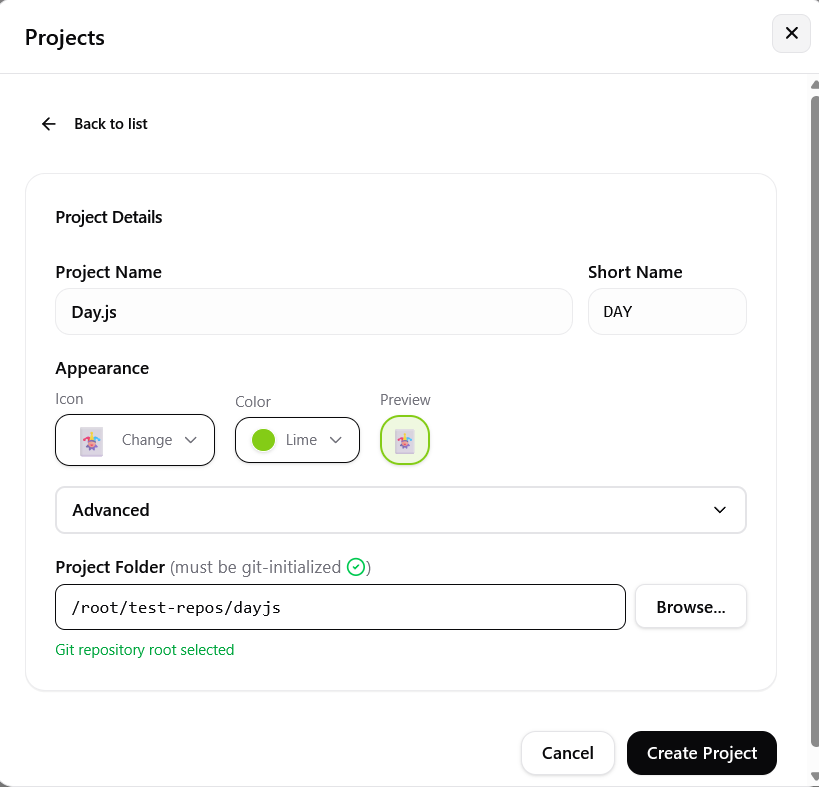
*Create a project and attach a local Git repository to LoopTroop.*
:::

**What you can do:**

- Set the project name, description, and appearance.
- Attach a local Git repository that has a GitHub remote.
- Choose how to attach a repository that LoopTroop has used before: restore its tickets, clear its tickets, or start fresh.
- Change advanced options inherited from the global configuration.

---

### Configuration [?](configuration.md "Open full documentation")

::: details Screenshot
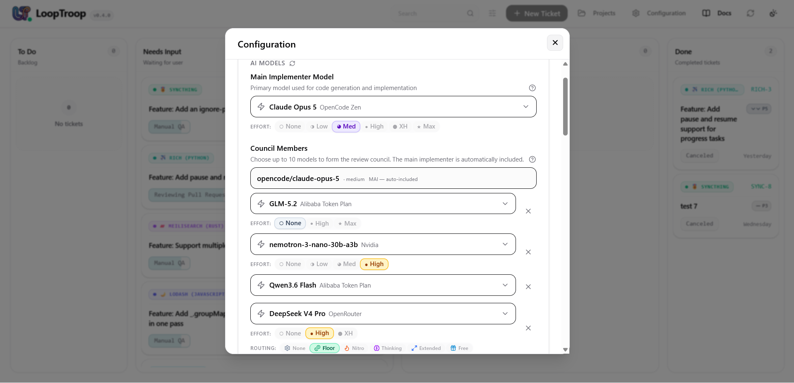
*Configure the main implementer, council members, effort levels, and project settings.*
:::

**What you can do:**

- Select the main implementer. This model is also a council member and handles implementation and other single-model steps. [?](configuration.md#main-implementer-model "Open full documentation")
- Select models for multi-model planning phases. [?](configuration.md#council-members "Open full documentation")
- Set supported effort levels for each council member and, where available, an OpenRouter routing variant such as `:floor` or `:nitro`. [?](configuration.md#effort--thinking-variant "Open full documentation")
- Configure the Git-hook policy: validate explicitly, run hooks for internal commits, or ignore internal-only hooks. [?](configuration.md#git-hook-policy "Open full documentation")
- Enable or disable Manual QA for tickets in this project. [?](configuration.md#manual-qa "Open full documentation")
- Set the log preview length for model tool calls. This limits only the text shown in the AI Model logs, not the content sent to the tool. [?](configuration.md#logging "Open full documentation")

**OpenCode provider recovery** [?](configuration.md#opencode-provider-recovery "Open full documentation")

1. **OpenCode Retry Limit:** Number of failed requests OpenCode can retry before the phase fails. [?](configuration.md#opencode-retry-limit "Open full documentation")
2. **OpenCode Retry Grace Window:** Time OpenCode may remain in a retrying state before LoopTroop treats the request as failed. [?](configuration.md#opencode-retry-grace-window "Open full documentation")
3. **OpenCode Max Steps:** Maximum steps OpenCode may take before its session closes. `0` allows unlimited steps. [?](configuration.md#opencode-max-steps "Open full documentation")

**AI thinking** [?](configuration.md#ai-thinking "Open full documentation")

1. **AI Response Timeout:** Time allowed for a planning-phase model request to complete. The default is 20 minutes. [?](configuration.md#ai-response-timeout "Open full documentation")
2. **Minimum Council Quorum:** Minimum number of council members required for voting phases. [?](configuration.md#min-council-quorum "Open full documentation")
3. **Maximum Interview Questions:** Maximum questions generated during the interview. [?](configuration.md#max-interview-questions "Open full documentation")
4. **Structured Output Retries:** Number of fresh attempts allowed when a model returns invalid structured output. [?](configuration.md#structured-output-retries "Open full documentation")

**Coverage** [?](configuration.md#coverage "Open full documentation")

1. **Coverage Follow-Up Budget:** Maximum follow-up questions generated during interview coverage checks. [?](configuration.md#coverage-follow-up-budget "Open full documentation")
2. **Interview Coverage Passes:** Number of coverage checks that can return the ticket to the interview when gaps remain. [?](configuration.md#interview-coverage-passes "Open full documentation")
3. **PRD Coverage Passes:** Number of PRD coverage checks when gaps remain. [?](configuration.md#prd-coverage-passes "Open full documentation")
4. **Beads Coverage Passes:** Number of blueprint coverage checks when gaps remain. [?](configuration.md#beads-coverage-passes "Open full documentation")

**Implementation and workspace setup** [?](configuration.md#implementation--workspace-setup "Open full documentation")

1. **Max Bead Retries:** Number of times a bead can retry before the phase fails. [?](configuration.md#max-bead-retries "Open full documentation")
2. **Per-Iteration Timeout:** Time allowed for a bead iteration before it fails. The default is 20 minutes. [?](configuration.md#per-iteration-timeout "Open full documentation")
3. **Execution Setup Timeout:** Time allowed for workspace setup before it fails. The default is 20 minutes. [?](configuration.md#execution-setup-timeout "Open full documentation")

---

## To Do [?](ticket-flow.md#4-workflow-groups--board-locations "Open full documentation")

### Backlog [?](ticket-flow.md#5-phase-inventory "Open full documentation")

::: details Screenshot
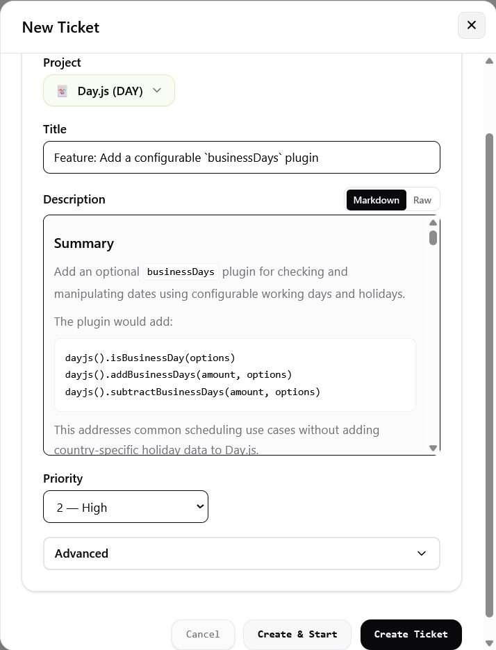
*Edit the ticket before starting the workflow.*
:::

**What you can do:**
- Edit the ticket title, description, priority, and ticket-level options.
- Change advanced options that otherwise inherit from the project and global configuration.
- Click **Create Ticket** to keep the ticket in the Backlog until you are ready to start it.
- Click **Create & Start** to start it immediately.
- When the workflow starts, LoopTroop runs initial checks and moves the ticket to Scanning Relevant Files. The ticket is then locked for editing. To change it, cancel the ticket and create a new one.
- You can cancel the ticket at any later point. It then moves to the Done column.

---

## Discovery [?](ticket-flow.md#3-state-machine-transition-model "Open full documentation")

### Scanning Relevant Files [?](ticket-flow.md#5-phase-inventory "Open full documentation")

::: details Screenshot
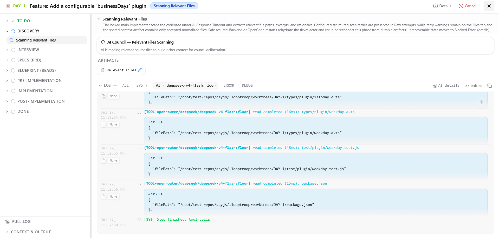
*The main implementer scans the codebase and records relevant files.*
:::

**What you can do:**
- View live logs, along with artifacts and logs from earlier phases.
- Review the generated index containing file paths, excerpts, relevance ratings, and rationales
- Wait for automatic transition to council drafting upon completion
- From this point onward, LoopTroop moves tickets between *Needs input* and *In progress* automatically. You cannot move them between Kanban columns manually.

---

## Interview [?](interview.md "Open full documentation")

### Council Drafting Questions [?](interview.md#3-how-questions-are-designed "Open full documentation")

::: details Screenshot
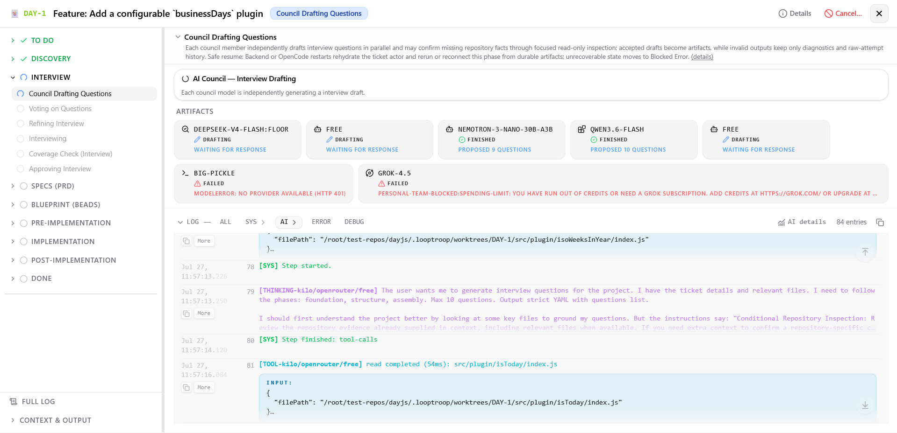
*Council members draft interview strategies in parallel.*
:::

**What you can do:**
- Monitor multi-model logs while council members independently generate candidate question lists
- View each model's progress and completed draft.

::: details Screenshot
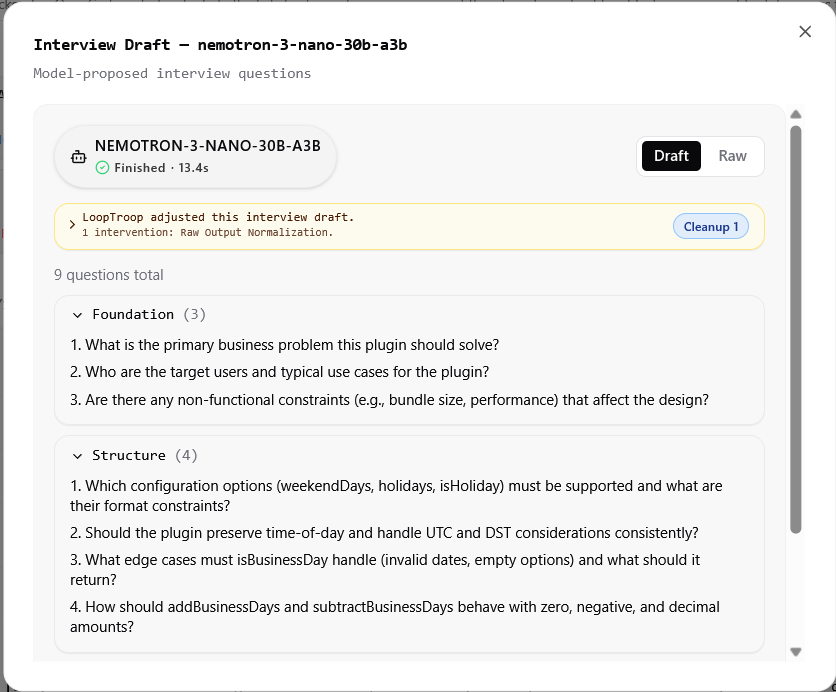
*An interview draft proposed by a council member.*
:::

---

### Voting on Questions [?](interview.md#3-how-questions-are-designed "Open full documentation")

::: details Screenshot
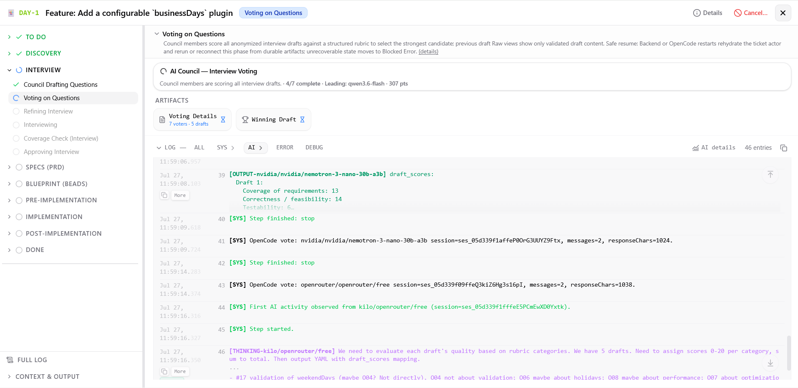
*Council members vote independently and anonymously.*
:::

**What you can do:**
- Watch voting progress across council members
- View anonymized candidate questionnaires and rubric scores (evaluating question relevance and coverage)
- Inspect the score breakdown and winning draft selection

::: details Screenshot
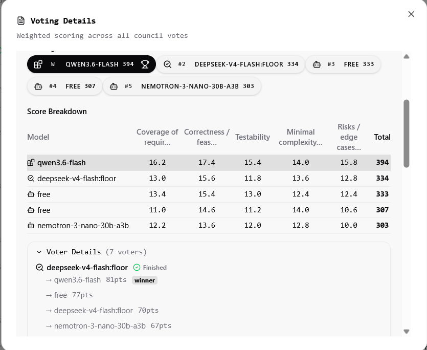
*Example anonymized voting results.*
:::

---

### Refining Interview [?](interview.md#5-live-interview-session-behavior "Open full documentation")

::: details Screenshot
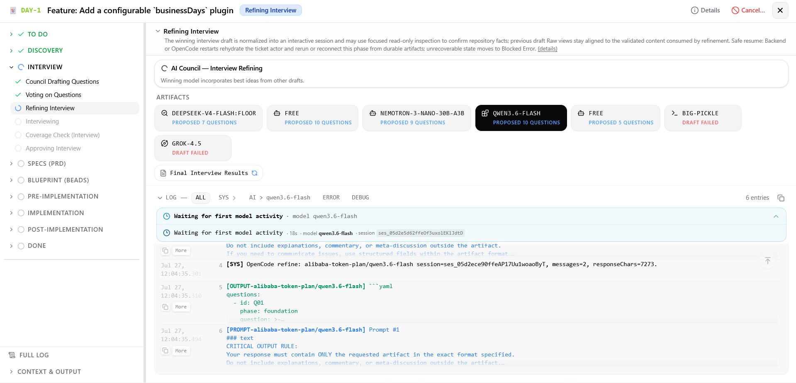
*The winning model reviews the other drafts and incorporates useful ideas.*
:::

**What you can do:**
- Monitor interview compilation progress

::: details Screenshot
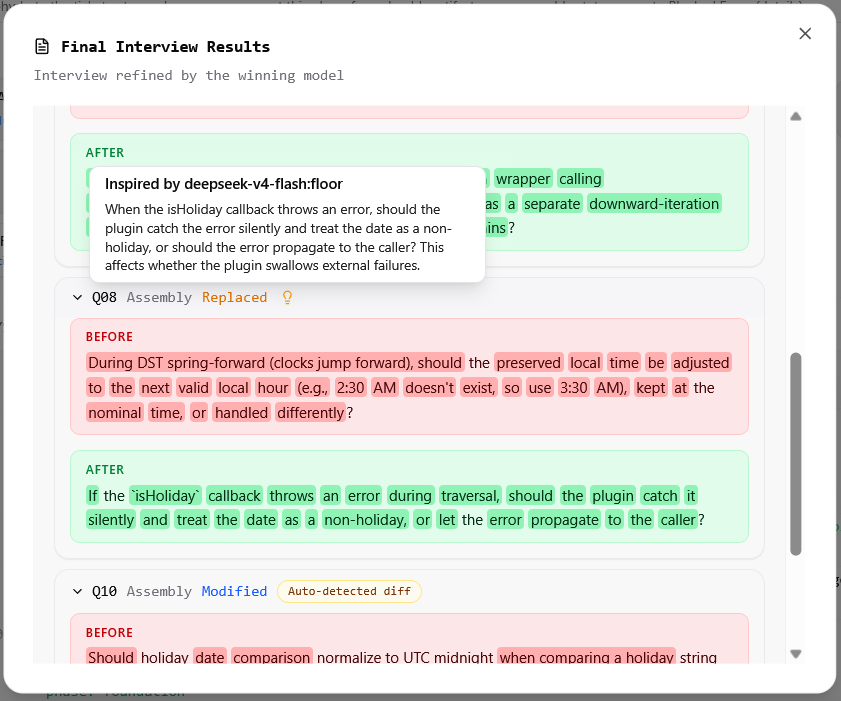
*Example of a question revised using an idea from another draft.*
:::

---

### Interviewing [?](interview.md#5-live-interview-session-behavior "Open full documentation")

::: details Screenshot
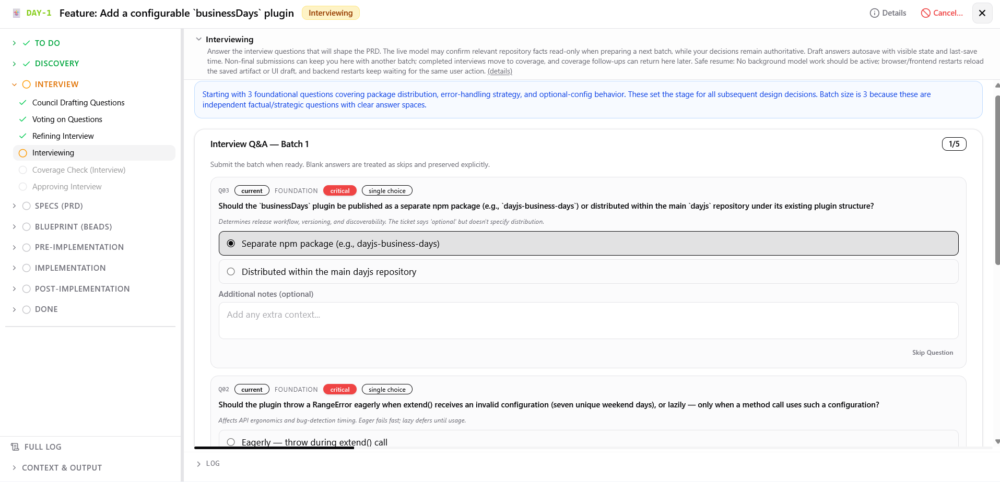
*Answer focused planning questions in adaptive batches of 1 to 3.*
:::

**What you can do:**
- Type responses to free-text questions, select options for choice-based questions, or edit earlier answers.
- Skip individual questions or restore a previously skipped question.
- Click **Submit** to process the current batch and receive the next questions or advance to coverage.
- Click **Skip All** to mark all remaining questions as skipped and move directly to Approving Interview. The PRD phase later fills skipped questions with AI-generated answers.

---

### Coverage Check (Interview) [?](interview.md#6-skips-final-free-form-and-coverage "Open full documentation")

::: details Screenshot
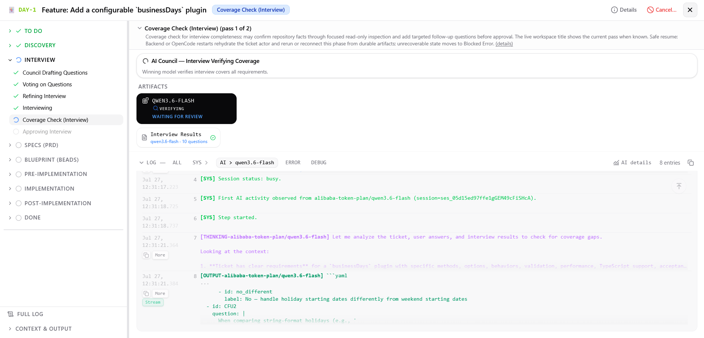
*Winning model checks answers for gaps and spawns follow-up rounds if budget permits.*
:::

**What you can do:**
- Monitor coverage audit progress as the winning model checks collected answers against the ticket description
- Return automatically to Interviewing with follow-up questions if gaps exist and budget remains.

---

### Approving Interview [?](interview.md#8-approval-editing-and-downstream-impact "Open full documentation")

::: details Screenshot
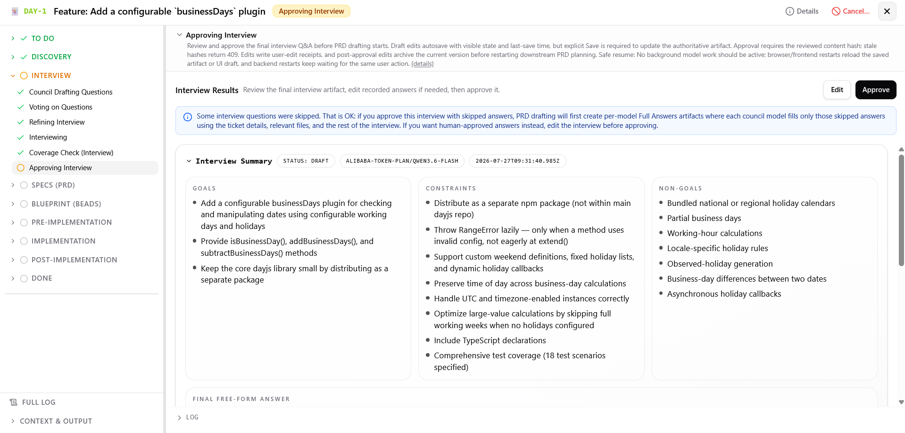
*Review and approve the structured interview artifact.*
:::

**What you can do:**
- Review questions, answers, and skipped items in the structured view or raw YAML editor.
- Edit answers with draft autosave. The same protection is available on editable approval screens.
- Click **Save** to update the authoritative interview artifact, then **Approve** to start Council Drafting Specs.
- Before Checking Readiness begins, you can return to Approving Interview or Approving Specs and edit the artifact. Saving an edit restarts downstream planning.

---

## Specs (PRD) [?](prd.md "Open full documentation")

### Council Drafting Specs [?](prd.md#3-part-1-full-answers "Open full documentation")

::: details Screenshot
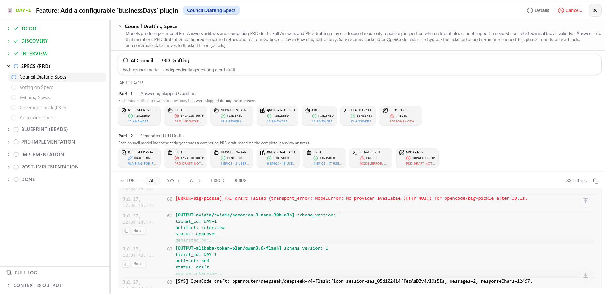
*Each model first resolves skipped questions, then drafts its own PRD (Product Requirements Document).*
:::

**What you can do:**
- Monitor Part 1 progress: council members fill skipped interview questions to create per-model Full Answers artifacts
- Monitor Part 2 progress: council members draft complete PRD specifications from relevant files and Full Answers

::: details Screenshot
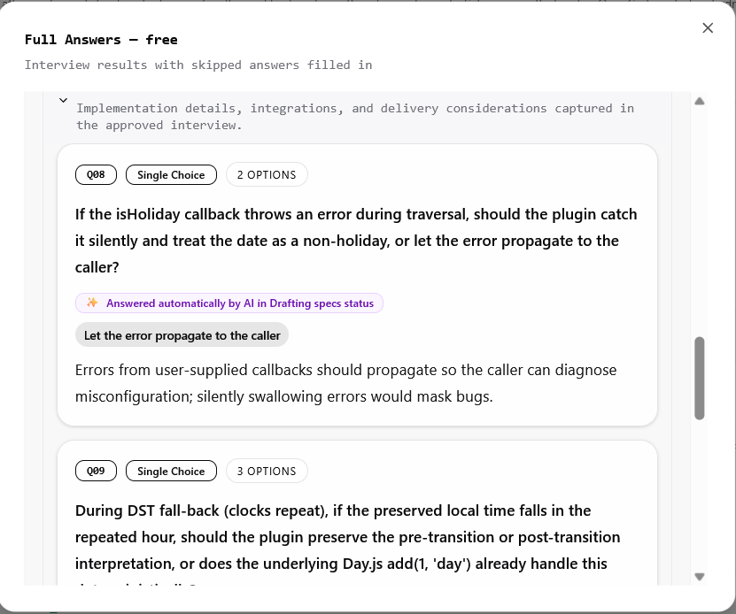
*Each model provides answers only for the interview questions the user skipped.*
:::

::: details Screenshot
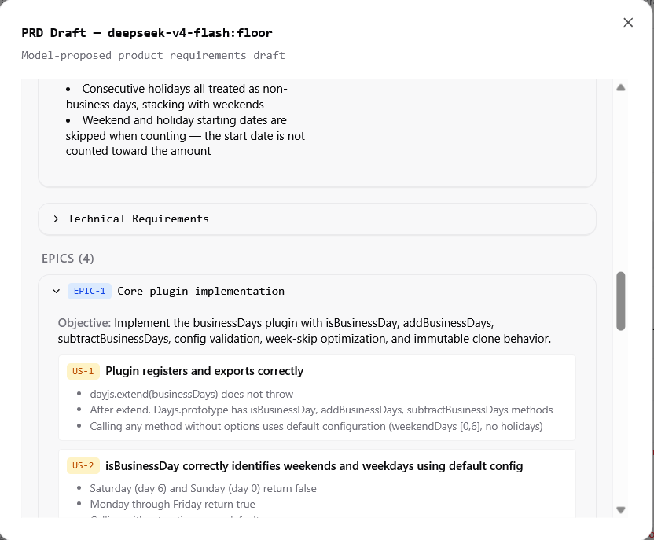
*Each model then creates its own PRD draft.*
:::

---

### Voting on Specs [?](prd.md#4-part-2-drafting-voting-and-refining "Open full documentation")

::: details Screenshot
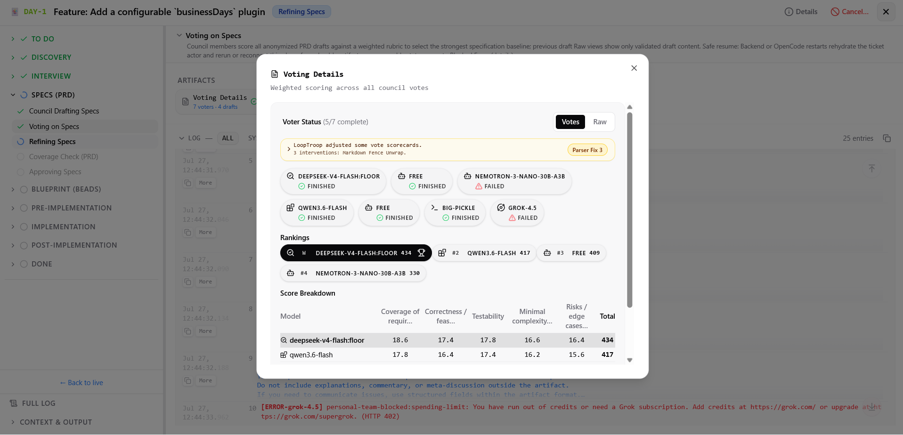
*Each model independently and anonymously votes on all PRD drafts.*
:::

**What you can do:**
- Watch voting progress across council members
- View anonymized PRD drafts and weighted rubric scores (evaluating requirement completeness, acceptance criteria quality, edge cases, test intent, and coherence)
- Inspect vote resolution and winning draft selection

---

### Refining Specs [?](prd.md#4-part-2-drafting-voting-and-refining "Open full documentation")

::: details Screenshot
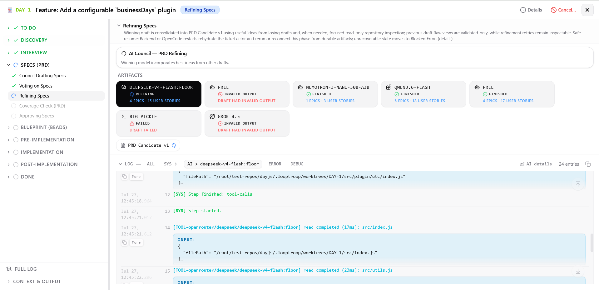
*Winning model incorporates strong elements from competing drafts into PRD Candidate v1.*
:::

**What you can do:**
- Monitor refinement progress as the winning model merges missing requirements and edge cases into its winning structure
- Inspect diff metadata showing what was added from losing drafts

::: details Screenshot
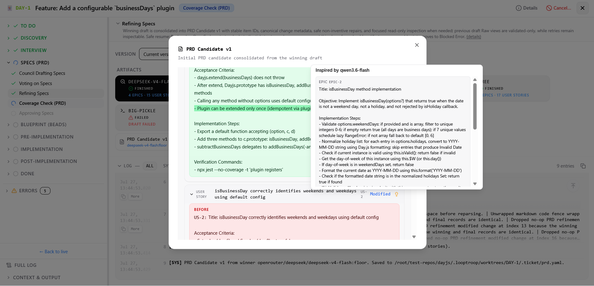
*Example of an addition from another draft.*
:::

---

### Coverage Check (PRD) [?](prd.md#6-coverage-and-candidate-versioning "Open full documentation")

::: details Screenshot
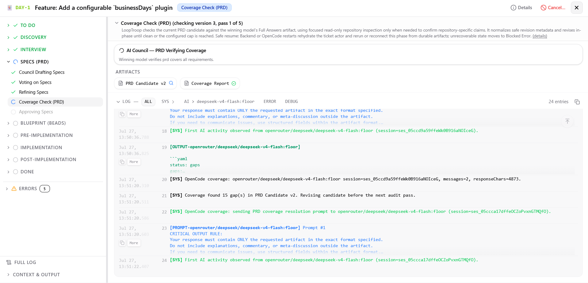
*The candidate PRD is checked against the winning Full Answers and revised until it is clean or reaches the pass cap.*
:::

**What you can do:**
- Monitor coverage audit progress as the candidate PRD is checked against the winning model's Full Answers
- Watch in-phase revisions (producing candidate v1, v2, and so on) when gaps are identified
- Observe live version progress.

::: details Screenshot
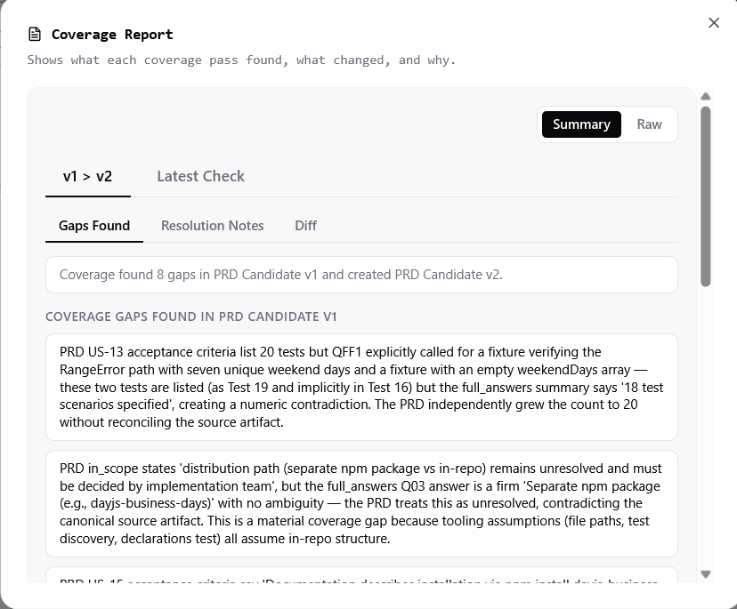
*Example coverage gap identified during PRD verification.*
:::

---

### Approving Specs [?](prd.md#7-approval-editing-and-downstream-impact "Open full documentation")

::: details Screenshot
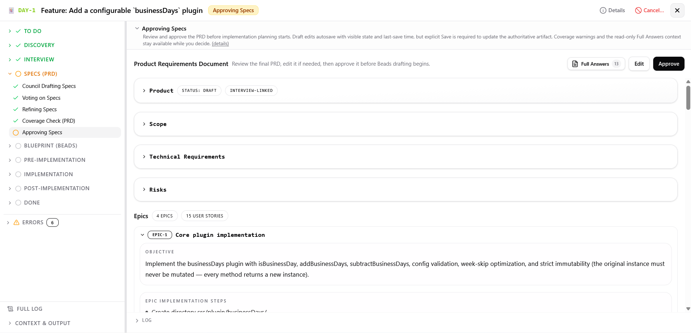
*Review the PRD requirements specification.*
:::

**What you can do:**
- Review requirements, acceptance criteria, edge cases, and test intent in structured view or raw YAML editor
- Open the read-only Full Answers chip to view the complete interview answer set used by the winning PRD model
- Review prominent coverage warnings if approval was reached after hitting the coverage pass cap
- Click **Fix gaps with AI** to run a targeted PRD revision and fresh coverage audit for unresolved gaps

---

## Blueprint (Beads) [?](beads.md "Open full documentation")

### Council Drafting Blueprint [?](beads.md#2-what-an-approved-bead-contains "Open full documentation")

::: details Screenshot
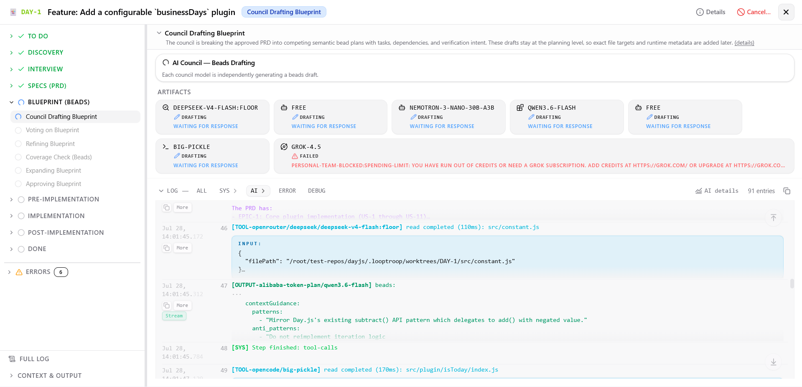
*Council members divide the specification into small beads with executable tasks and verification criteria.*
:::

**What you can do:**
- Monitor parallel blueprint generation as council members split the PRD into semantic task units
- View task counts, dependency graph structures, and beads structure for each council member's draft

::: details Screenshot
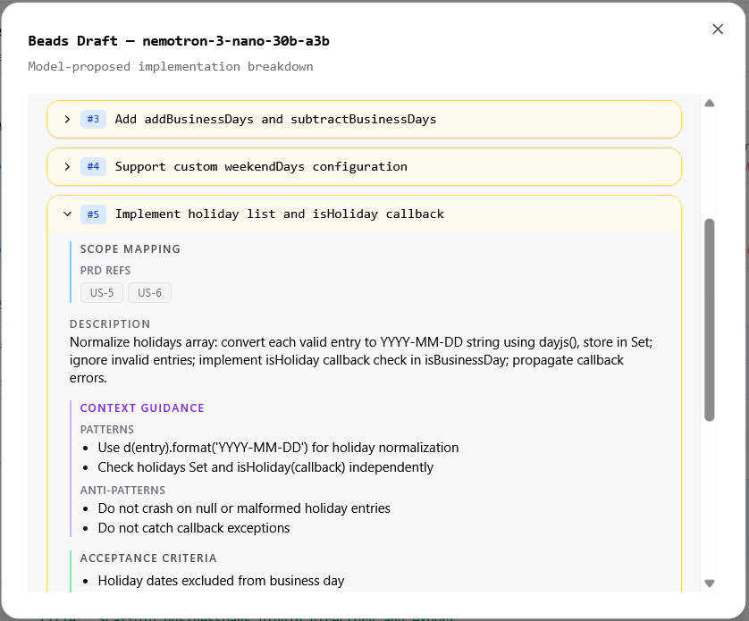
*Example bead blueprint. During implementation, each bead is the model's primary task context.*
:::

---

### Voting on Blueprint [?](beads.md#2-what-an-approved-bead-contains "Open full documentation")

::: details Screenshot
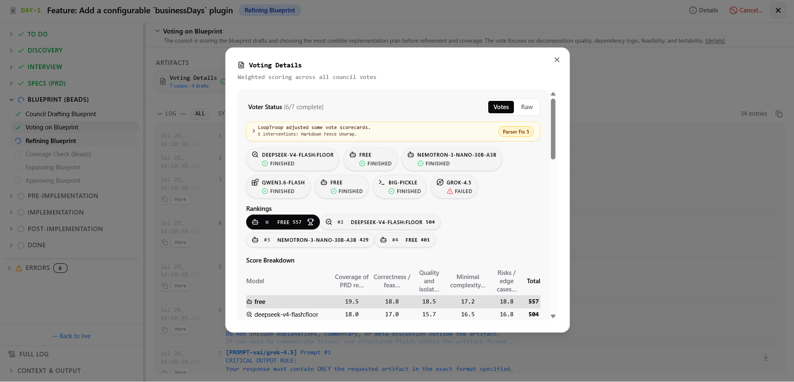
*Beads drafts rated on graph logic, file target isolation, and testing strategy.*
:::

**What you can do:**
- Watch voting progress across council members
- View anonymized blueprints and architecture rubric scores (evaluating task decomposition, feasibility, dependency acyclicity, and testability)
- Inspect vote resolution and winning blueprint selection

---

### Refining Blueprint [?](beads.md#3-storage-editing-and-approval-semantics "Open full documentation")

::: details Screenshot
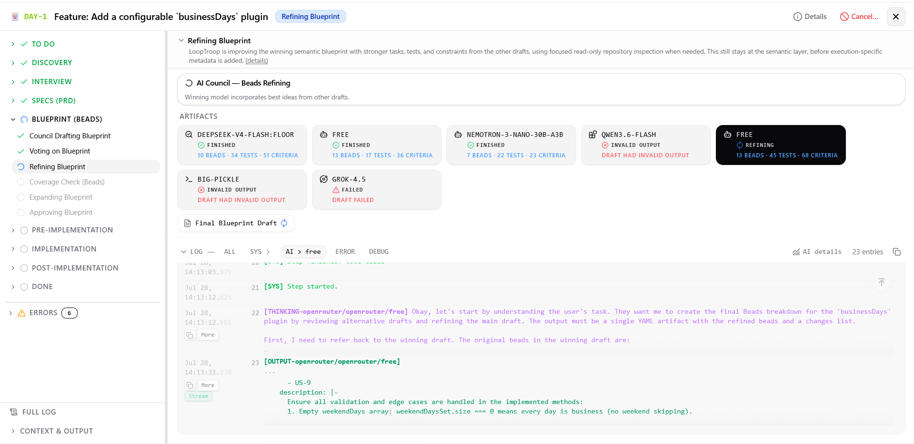
*Winning blueprint merges strong verification steps from alternative drafts.*
:::

**What you can do:**
- Monitor refinement progress as the winning model incorporates extra tasks, edge cases, and verification steps from losing blueprints
- Inspect blueprint diff metadata

::: details Screenshot
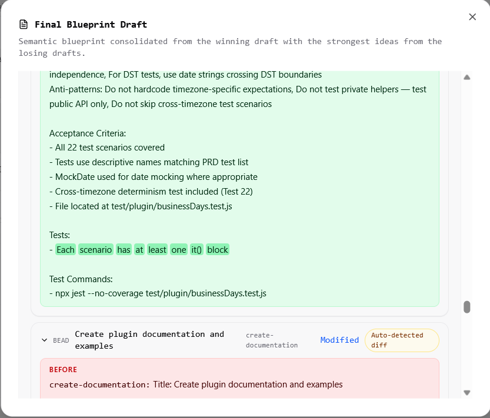
*Example changes to a bead after incorporating ideas from another draft.*
:::

---

### Coverage Check (Beads) [?](beads.md#3-storage-editing-and-approval-semantics "Open full documentation")

::: details Screenshot
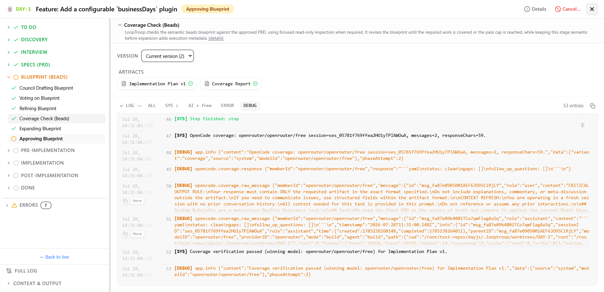
*The blueprint is checked against the PRD and revised when criteria are missing. The screenshot shows version 2 because the first model response was malformed and could not be repaired safely. Multiple attempts may appear when a phase encounters an error.*
:::

**What you can do:**
- Monitor semantic blueprint auditing against the approved PRD
- Watch in-phase revisions when required PRD outcomes lack corresponding beads
- Observe live version progress

::: details Screenshot
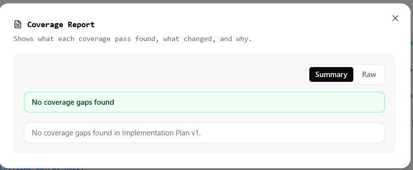
*Example of a clean coverage report.*
:::

---

### Expanding Blueprint [?](beads.md#2-what-an-approved-bead-contains "Open full documentation")

::: details Screenshot
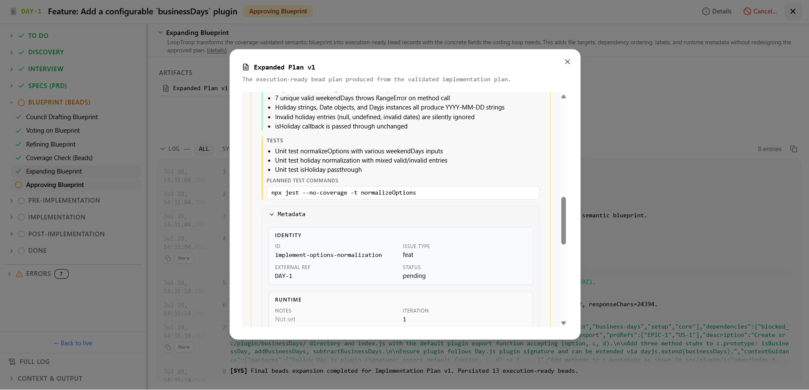
*LoopTroop adds the execution fields that are not needed while the council is drafting the semantic blueprint.*
:::

**What you can do:**
- Monitor expansion progress as the semantic blueprint is converted into execution-ready bead records
- Verify added file targets, dependency ordering, labels, and runtime metadata

---

### Approving Blueprint [?](beads.md#3-storage-editing-and-approval-semantics "Open full documentation")

::: details Screenshot
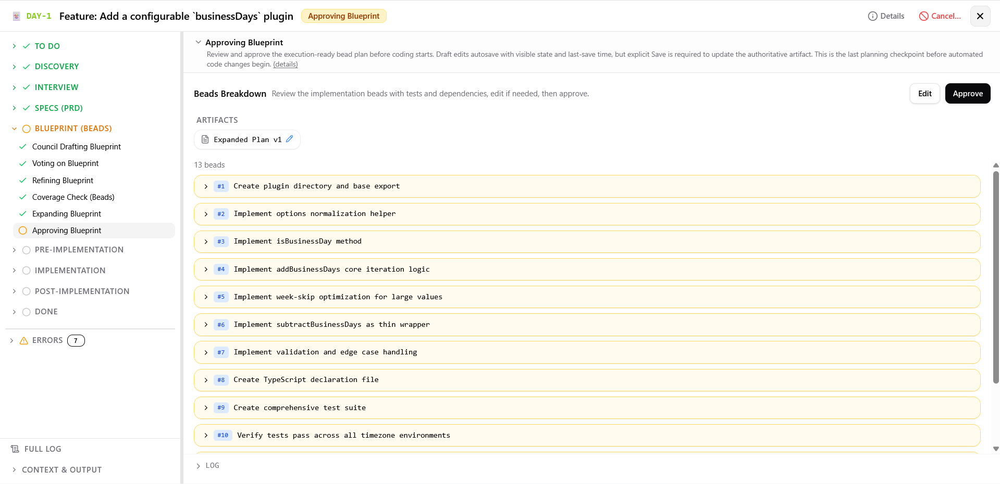
*Review the dependency graph and executable plan before coding starts.*
:::

**What you can do:**
- Review task descriptions, acceptance criteria, dependency graphs, file targets, and planned commands or no-command reasons
- Review coverage warnings if approval was reached after hitting the coverage pass cap
- Click **Fix gaps with AI** to revise the semantic blueprint and re-run expansion for remaining gaps
- Edit the plan in structured or raw editor with draft autosave, then click **Save** to update the authoritative plan

---

## Pre-Implementation [?](pre-implementation.md "Open full documentation")

### Checking Readiness [?](pre-implementation.md#1-pre_flight_check-deterministic-readiness-gate "Open full documentation")

::: details Screenshot
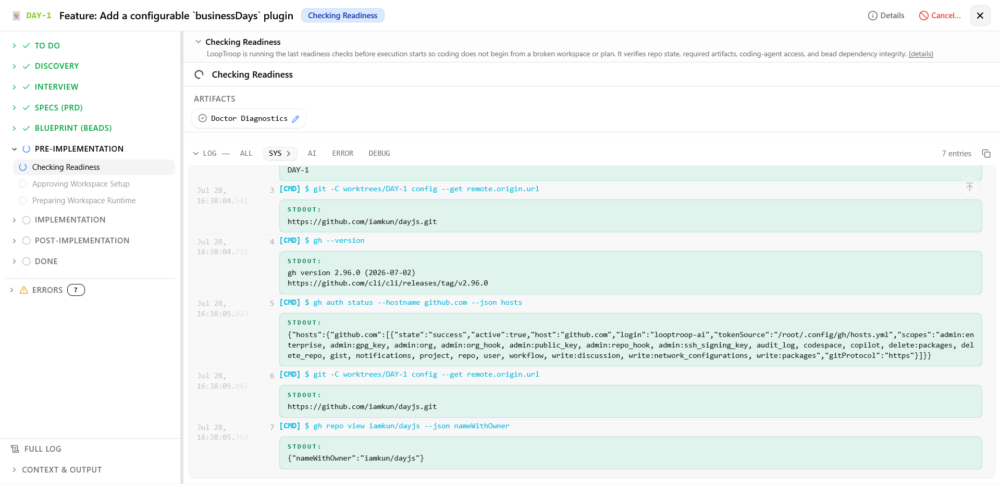
*Checks workspace cleanliness, Git worktree hygiene, OpenCode reachability, and execution locks.*
:::

**What you can do:**
- Monitor pre-flight validation checks: workspace directory existence, required artifacts, Git worktree cleanliness, OpenCode connectivity, execution capability probe prompt, and bead graph acyclicity
- Review generated pre-flight report detailing pass, warning, and failure entries

::: details Screenshot
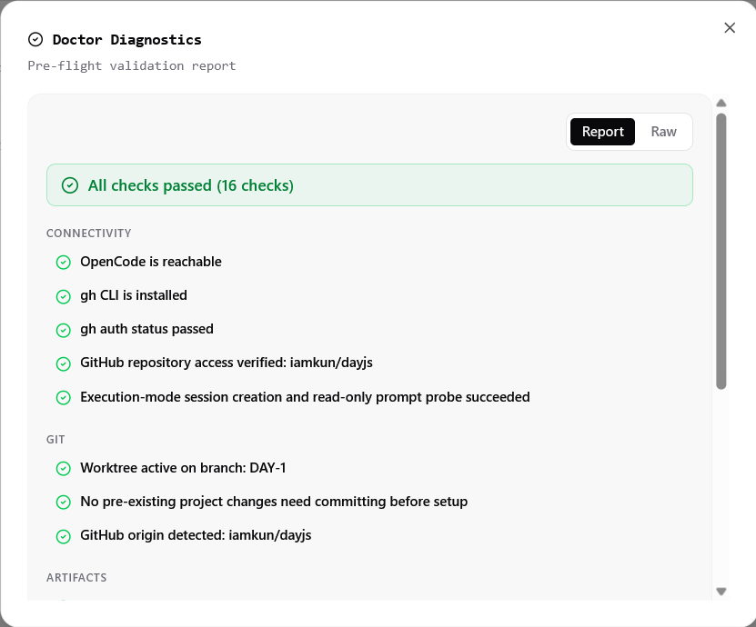
*Example of a successful readiness check.*
:::

---

### Drafting Workspace Setup Plan [?](pre-implementation.md#2-generating_execution_setup_plan-draft-the-setup-contract "Open full documentation")

This active status keeps its generation log expanded and shows an artifact placeholder immediately, followed by the complete generated setup plan and generation report. Use the version selector to inspect archived generations. If structured retries cannot repair a malformed response, the rejected output and diagnostics remain available before LoopTroop hands the result to the approval gate with only Regenerate enabled.

There is no new screenshot for this status yet; this guide intentionally documents the new lifecycle step without capturing an end-to-end run.

---

### Approving Workspace Setup [?](pre-implementation.md#3-waiting_execution_setup_approval-review-the-setup-contract "Open full documentation")

::: details Screenshot
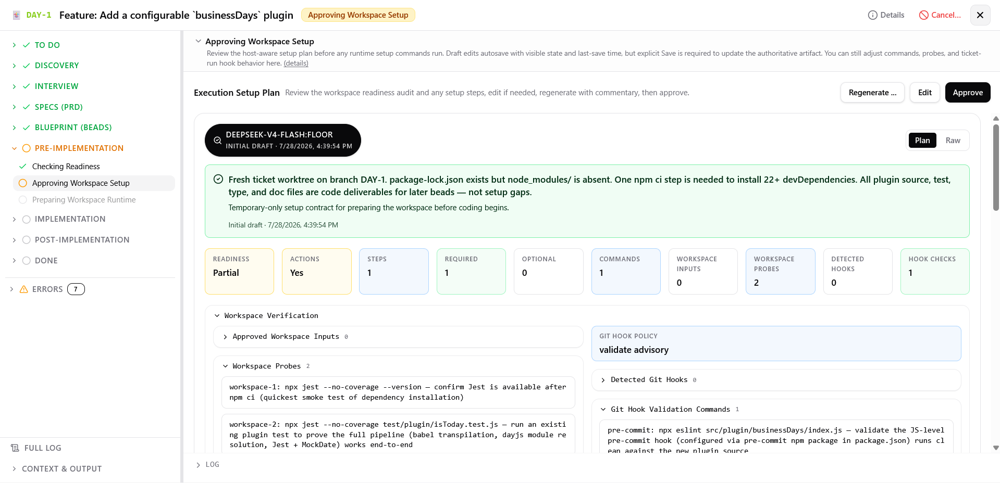
*Review the setup plan before implementation: readiness assessment, workspace inputs, setup steps, Git hooks, and policy.*
:::

**What you can do:**
- Review readiness assessment, temporary setup steps, workspace probes, command families, read-only detected Git hooks, and editable validation commands
- Edit setup steps or validation commands
- Click **Regenerate with commentary** to preserve the current draft and input durably, archive the current generation/approval attempts, and enter **Drafting Workspace Setup Plan** for a fresh version

---

### Preparing Workspace Runtime [?](pre-implementation.md#4-preparing_execution_env-temporary-runtime-setup "Open full documentation")

::: details Screenshot
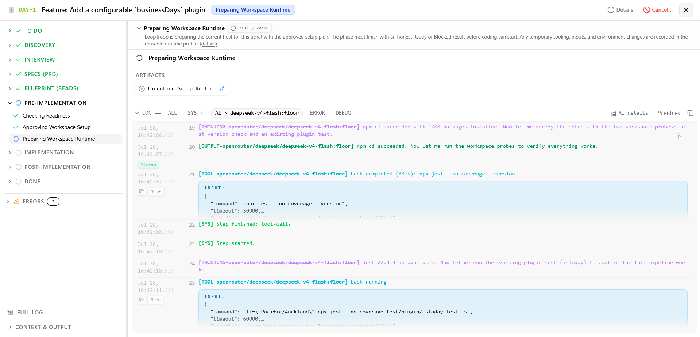
*Materializes approved workspace inputs, runs setup, verifies probes, and validates hooks.*
:::

**What you can do:**
- Monitor workspace input materialization, temporary tool provisioning and setup execution
- Watch validation of the runtime wrapper and workspace probes
- Review the Error (reason) screen when setup finishes blocked or fails validation.

    * Click **Retry with extra note...** from live blocked view to send a prompt directly to the preserved setup session for a manual attempt

    * Click **Edit setup plan...** from live blocked view to rewind to setup approval

---

## Implementation [?](beads.md#7-the-single-bead-execution-cycle "Open full documentation")

### Implementing [?](beads.md#7-the-single-bead-execution-cycle "Open full documentation")

::: details Screenshot
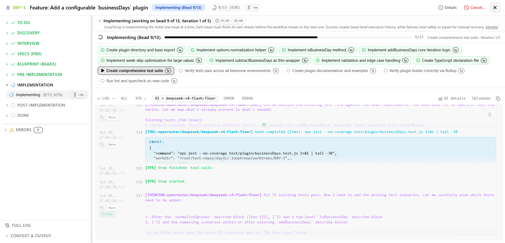
*LoopTroop implements one bead at a time in dependency order, using the bead details as task context.*
:::

**What you can do:**
- Monitor bead-by-bead execution in real time
- Track progress with the bead completion counter and ETA range in the workspace header. The displayed time is the remaining time for the current iteration. If it expires, LoopTroop starts a fresh iteration with the bead details and a note about the failure. The project configuration sets the timeout and retry budget; the defaults are 20 minutes and five iterations.
- View live execution logs, visible agent responses, file modification events, and command outputs for the active bead
- Inspect each bead's status (pending, in progress, done, or error) and code-only diff.
- Watch automatic Ralph recovery after a failure. It appends a structured note, resets the worktree, increments the iteration, and retries within the configured budget.
- Review Error (reason) if a bead exhausts its retry budget or local commit finalization fails.

::: details Screenshot
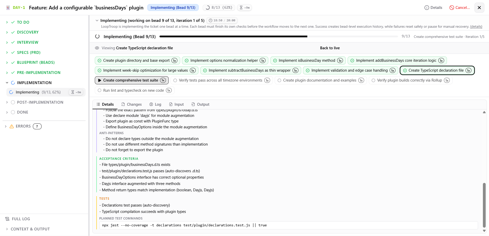
*Open a bead to view its details, logs, diff, and input/output in separate tabs.*
:::

::: details Screenshot
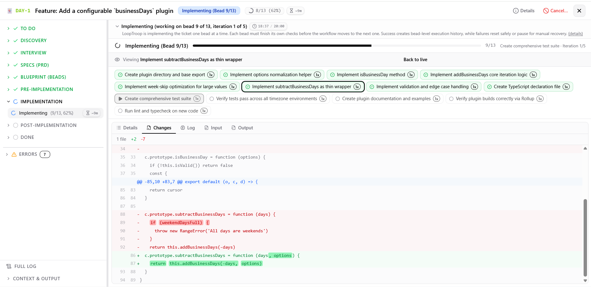
*Changes made by a bead.*
:::

::: details Screenshot
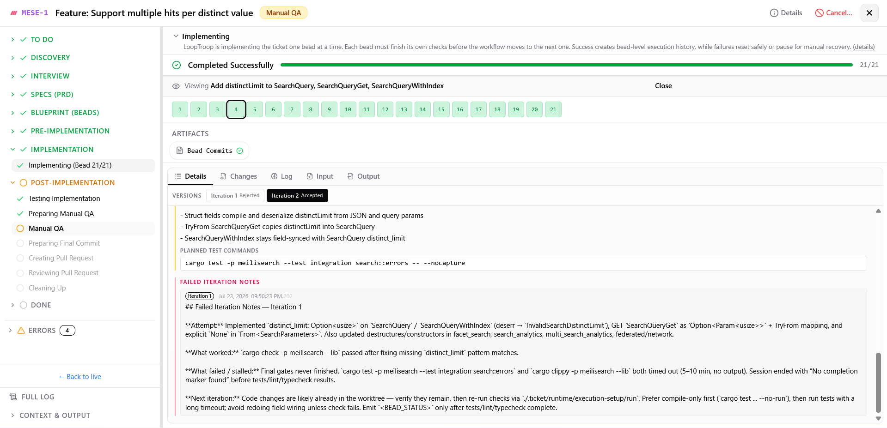
*Example of a Ralph recovery loop from another ticket. The second iteration succeeds after receiving the appended note.*
:::

::: details Screenshot
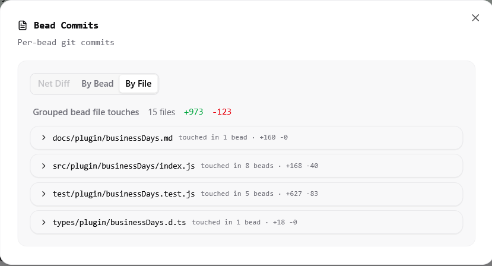
*All changes made during implementation, shown at the end of the phase.*
:::

---

## Post-Implementation [?](post-implementation.md "Open full documentation")

### Testing Implementation [?](post-implementation.md#1-running_final_test-ticket-level-verification "Open full documentation")

::: details Screenshot
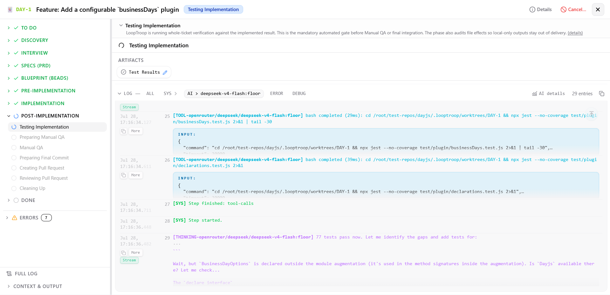
*The main implementer creates a whole-ticket test plan and runs it with the approved runtime profile.*
:::

**What you can do:**
- Monitor whole-ticket test plan generation based on ticket details, PRD, and beads
- Watch test command execution in the worktree through the setup wrapper
- Review test results, pass/fail status per test, and output logs
- Inspect the file-effects audit classifying dirty files as delivery candidates or local-only outputs

---

### Preparing Manual QA [?](post-implementation.md#15-optional-manual-qa-route "Open full documentation")

- Watch the main implementer generate the checklist from the PRD and bead context.

---

### Manual QA [?](post-implementation.md#15-optional-manual-qa-route "Open full documentation")

::: details Screenshot
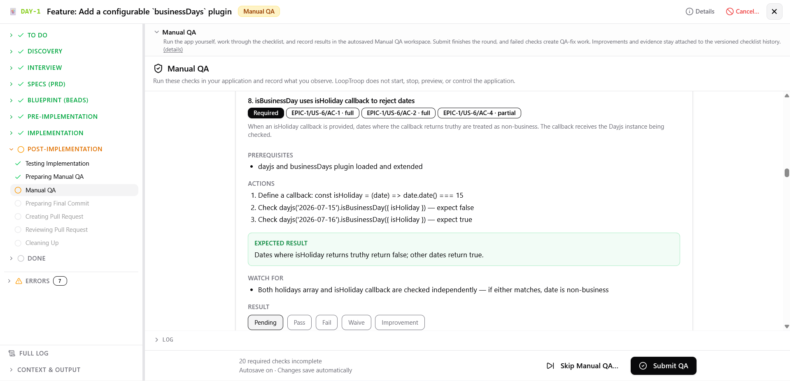
*Run manual verification.*
:::

**What you can do:**
- Run and control the application independently outside LoopTroop
- Evaluate each checklist item as Pass, Waive, Fail, Pending, or Improvement.
  - **Pass:** The item meets its acceptance criteria. A note is optional.
  - **Waive:** The item does not apply or is skipped. A note is optional.
  - **Fail:** The item does not meet its acceptance criteria. A note is required. LoopTroop can create a QA bead for each failed item or combine failures into one QA bead, then return the ticket to Implementing.
  - **Improvement:** LoopTroop creates a separate Backlog ticket from the item result.
- Attach links or upload files as evidence for each item
- Click **Skip Manual QA...** to archive entered data read-only without creating fix work or child tickets

---

### Preparing Final Commit [?](post-implementation.md#3-integrating_changes-building-the-local-candidate-commit "Open full documentation")

::: details Screenshot
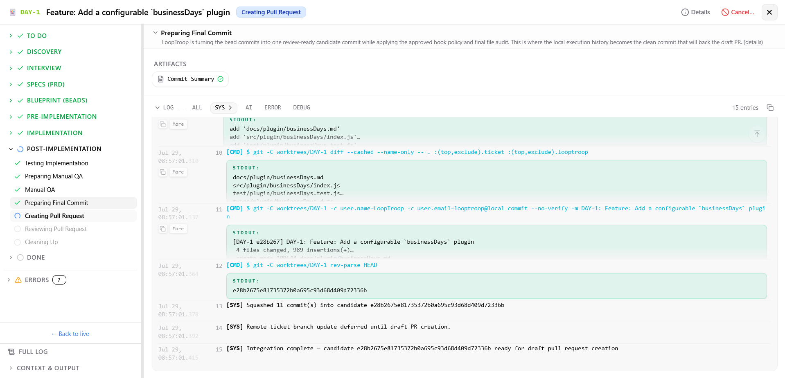
*Runs Git-hook validation again, stages the changes, and squashes bead-level commits into a clean candidate commit.*
:::

---

### Creating Pull Request [?](post-implementation.md#4-creating_pull_request-final-diff-audit-and-draft-pr-creation "Open full documentation")

::: details Screenshot
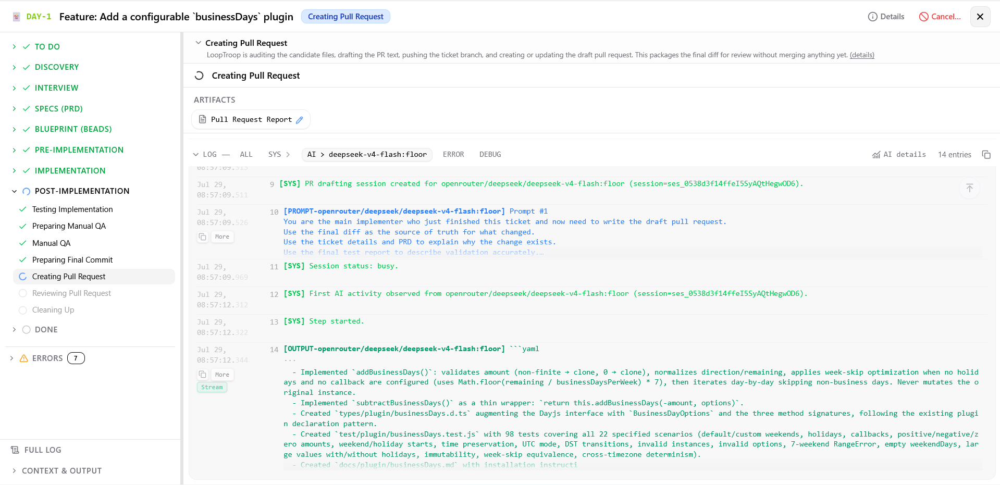
*Performs the final candidate audit, pushes the branch, and drafts the pull request title and description.*
:::

---

### Reviewing Pull Request [?](post-implementation.md#5-waiting_pr_review-human-merge-or-finish-gate "Open full documentation")

::: details Screenshot
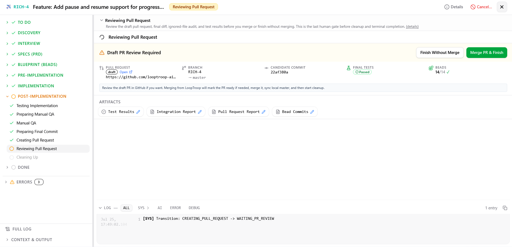
*Review the pull request, then finish after merging it or leave it unmerged.*
:::

**What you can do:**
- Review the draft pull request directly on GitHub via provided URL
- Inspect Net Diff, By Bead, or By File diff views in the local workspace
- Review candidate file audit, final test summary, and integration report
- Click **Merge PR & Finish** to mark PR ready, merge on GitHub, verify remote base branch, and advance to cleanup
- Click **Finish Without Merge** to leave PR open/unmerged and advance directly to cleanup

---

### Cleaning Up [?](post-implementation.md#6-cleaning_env-remove-runtime-state-keep-the-evidence "Open full documentation")

::: details Screenshot
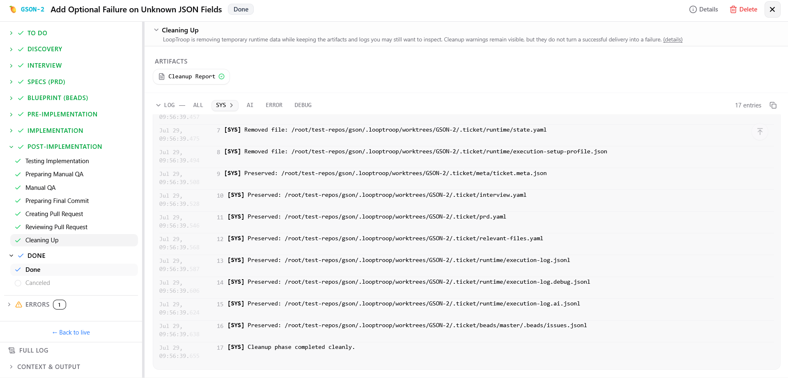
*Deletes temporary lockfiles, wrapper hooks, and session directories while preserving planning files and audit trails.*
:::

- After this phase, the ticket is complete and moves to the Done column of the Kanban board.

---

## Done [?](ticket-flow.md#5-phase-inventory "Open full documentation")

### Done [?](ticket-flow.md#5-phase-inventory "Open full documentation")

**What you can do:**
- Review all ticket artifacts, logs, test reports, integration reports, PR details, and cleanup summary
- Inspect final net diff and full implementation history
- The ticket is read-only in this terminal state.

---

### Canceled [?](ticket-flow.md#9-retry-continue-and-blocked-error-semantics "Open full documentation")

**What you can do:**
- Review existing artifacts and execution logs created prior to cancellation
- The ticket is read-only in this terminal state.
- Create a new ticket if work needs to be restarted

---

## Errors [?](ticket-flow.md#9-retry-continue-and-blocked-error-semantics "Open full documentation")

### Error (reason) [?](ticket-flow.md#9-retry-continue-and-blocked-error-semantics "Open full documentation")

::: details Screenshot
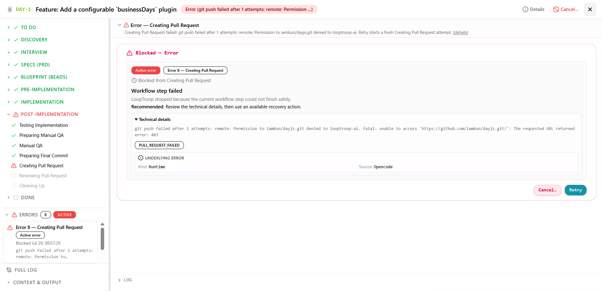
*Recovery screen that preserves the previous phase, diagnostics, and eligible continuation options.*
:::

**What you can do:**
- Read plain-language root cause explanation, recommended actions, and technical error details under collapsed section
- Click **Retry** to archive the active attempt and re-enter the failed phase, or reset the failed bead during Implementing.
- Click **Retry with extra note...** to append guidance to User Retry Notes during Implementing, or send a prompt to the preserved setup session during Preparing Workspace Runtime.
- Click **Continue** to resume an addressable OpenCode session after transient provider, network, or rate-limit interruptions without archiving phase attempts
- Click **Edit setup plan...** (when setup failed) to rewind to setup approval
- Click **Cancel** to move the ticket to Canceled.

---

## Related Docs

- [Ticket Flow](ticket-flow.md): Detailed state machine documentation and transitions
- [Beads & Execution](beads.md): Bead structure, execution loops, and recovery mechanics
- [System Architecture](system-architecture.md): Module map and storage ownership
- [Getting Started](getting-started.md): Installation and first run setup
